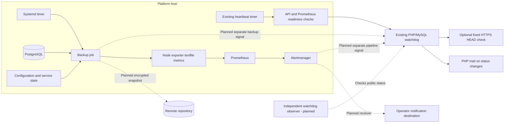

# M1 implementation details — Recoverable and observable lab

Design date: 2026-09-22. Status: partially implemented foundation, updated for the
recreated watchdog. Sections explicitly distinguish existing code from remaining
work. This document does not establish public deployment or successful recovery.
It expands items 1–2 of the [implementation plan](implementation-plan.md) and
targets OPS-006 plus the initial operational foundation for OPS-007.

## Outcome and existing foundation

M1 is complete when the operator receives actionable outage and backup alerts,
and can recover the platform on a clean host using an encrypted off-host backup
and independently available recovery credentials. Full shared-service monitoring
and project dashboards remain in M5.

The repository already provides:

- [Prometheus rules](../infrastructure/monitoring/alerts.yaml) for failed scrapes,
  low disk space, and unavailable workload replicas.
- [Alertmanager routing](../infrastructure/monitoring/alertmanager.yaml) with a
  local-only receiver that sends no notifications.
- API `/healthz` and `/readyz` endpoints. Readiness checks the platform database
  and Kubernetes connectivity; it does not check every project database.
- The [external PHP/MySQL watchdog](../watchdog/README.md), an authenticated
  [heartbeat endpoint](../watchdog/public/heartbeat.php), and a public status page.
  Its cron checks freshness and optionally one fixed HTTPS target, and attempts
  email on state changes.
- A [host sender](../scripts/heartbeat.py) and
  [systemd timer](../infrastructure/systemd/platform-heartbeat.timer) that check
  local API and Prometheus readiness before sending the heartbeat.
- A [backup script](../scripts/backup.sh) that atomically publishes a compressed
  `pg_dumpall` locally and a [manual restore procedure](../docs/operations.md).
- Persistent PostgreSQL, Caddy, and Grafana volumes. Kubernetes workload resources
  can be recreated from stored project specifications and `DATABASE_KEY`.

The implementation should extend these pieces rather than introduce another
platform control plane. Watchdog code is present; public hosting, systemd/cron
installation, and real email delivery still require acceptance evidence. Backup
automation and the proposed Alertmanager pipeline watchdog remain unimplemented.

## Proposed decisions and deployment inputs

Use a host systemd timer to run the backup independently of the application
cluster. Use restic for encrypted snapshots in a remote repository. Configure
Alertmanager with one real receiver and retain the recreated PHP/MySQL watchdog
on independent web hosting. Extend it for the additional signals below. Its cron
already attempts email without contacting the platform's Prometheus or Alertmanager.

The following distinguish current watchdog defaults from proposed backup and
monitoring extensions; none is a verified service commitment:

| Setting | Proposed value | Reason or required decision |
| --- | --- | --- |
| Backup schedule | Every 12 hours, UTC | Leaves margin for a retry within a 24-hour data-loss target. |
| Recovery point objective (RPO) | At most 24 hours of lost data | Measure from the recoverable data capture time, not upload completion. Operator must confirm suitability. |
| Recovery time objective (RTO) | Four hours from recovery declaration to verified service | Include host provisioning, downloads, restoration, validation, and routing changes. Requires an available replacement-host path. |
| Backup timeout | Two hours per attempt | Bound stalled jobs; revisit using measured database size and bandwidth. |
| Retention | 14 daily, 8 weekly, 6 monthly snapshots | A proposed recovery history, subject to storage budget and data retention requirements. |
| Host heartbeat | Existing: two-minute boot delay, then 60-second interval with up to five seconds randomized delay | Sender requires HTTP 200 from local API `/readyz` and Prometheus `/-/ready`, then HTTP 204 from the HTTPS heartbeat endpoint. |
| Heartbeat expiry | Existing: `max_age=300` seconds | Fresh at exactly 300 seconds; cron detects expiry on its next run. Allow roughly six minutes from the last accepted heartbeat plus check/mail latency; measure actual receipt. |
| Public probe interval | Existing: operator-installed cron every minute; one optional HEAD check | No consecutive-failure debounce exists. A failed check changes state on that run; GET/body validation is proposed below. |
| Watchdog cron freshness | Existing: status page requires a check within 180 seconds | A stale cron makes the page return 503; a separate observer must turn that into a notification. |
| Successful-backup age | Warning at 14 hours; critical at 24 hours | A failed attempt alerts immediately; age rules also detect jobs that never run. |
| Notification destination | Existing watchdog: PHP `mail()` with configured sender/recipient; Alertmanager receiver still to configure | Record actual receipt, responder, escalation contact, and delivery-failure procedure. Mailer acceptance is not inbox delivery. |
| External monitor | Existing PHP/MySQL watchdog on independent hosting | Verify hosting, PDO-MySQL, minute cron, HTTPS/header forwarding, and mail delivery; cURL is required for optional probing. |
| Backup destination | Remote restic repository, preferably with independently protected history | Record endpoint, account, credentials, capacity, and tested access/deletion policy. |

Provider choices are deployment inputs, not reasons to postpone local scripts,
configuration templates, or tests. Reuse the watchdog rather than select its
replacement. Real delivery, storage access, and restore
measurements are required before closing M1. Localhost-only installations can
exercise simulated checks but cannot demonstrate public outage detection.

## Data flow and failure boundaries

Solid edges show existing watchdog code paths; dotted edges are proposed. The
backup job and its local metrics path are also proposed. The existing heartbeat
is sent directly by the host script, so it cannot establish that Prometheus rules
are evaluated or Alertmanager notifications reach a receiver.

The database currently has one monitor row (`id=1`), and the heartbeat endpoint
updates that row regardless of request body. Do not point Alertmanager or a backup
job at that endpoint: either could refresh platform health and hide a failed sender.
Add separate signal identities, timestamps, deadlines, and scoped credentials for
platform health, alert delivery, and backup freshness. Preserve the current
platform endpoint during migration and test that signals cannot refresh each other.

The independent notification route should avoid the primary provider where
practical; a shared mail provider remains a documented shared failure dependency.

## 1. Alert delivery and external availability checks

### Existing watchdog behavior and verification gaps

The PHP endpoint requires POST and a constant-time bearer-token match, then
atomically throttles accepted heartbeats to one every 30 seconds. Cron uses a
database lock, combines freshness with the optional HTTPS check, stores results,
and retains 30 days of check history. Email is attempted when state differs from
the last successfully handed-off notification. Failed `mail()` handoffs are
retried on a later cron run; successful handoff does not prove delivery.

The public page returns 503 for stale heartbeat, stale cron, or recorded failure.
Cron cannot notify about its own complete failure, and public status alone does
not page an operator. Configure an independent observer of that page or a hosting
scheduler failure service with a tested notification route.

The existing [PHP freshness test](../tests/watchdog.php) covers boundary cases.
The [disposable integration script](../scripts/test-watchdog.py) exercises missing
authentication, method checks, throttling, expiry, recovery, and stale-cron status.
It disables public probing and substitutes `/bin/true` for email. Add wrong-token,
mail-handoff failure/retry, public-probe failure, and host-sender failure tests;
verify real outage/recovery email separately. Existing tests were inspected, not
rerun for this documentation update.

### Receiver configuration

Replace the `local-only` receiver with a deployment-specific email or supported
webhook receiver. Keep grouping and repeat behavior explicit; proposed labels are
`environment`, `instance`, `alertname`, and, where relevant, `project`. Send both
firing and resolved notifications, including severity, first observed time,
affected resource, and a link or reference to the response procedure.

Keep receiver credentials in restricted files mounted read-only into Alertmanager.
Use supported file-based secret fields, such as `smtp_auth_password_file`, rather
than committing credentials or assuming YAML files interpolate environment
variables. Validate the final configuration against the repository's pinned
Alertmanager version. Receiver types, routing, and credential-file options are
described in the [Alertmanager configuration reference](https://prometheus.io/docs/alerting/latest/configuration/).

Keep a non-secret template in Git and generate any deployment-specific output in
`.runtime/`. Fail operational setup when the receiver is still a placeholder.
Basic local development may retain an explicit notification-disabled mode, but
that mode does not satisfy M1.

### Delivery failure detection

Add Alertmanager's internal metrics endpoint to Prometheus and alert on delivery
failures and scrape failures. Confirm metric names against the pinned image
before writing rules. A local delivery-failure alert cannot report through the
same broken receiver reliably. Extend the existing external watchdog with a
separate alert-pipeline signal:

1. Prometheus emits a continuously firing watchdog alert.
2. A dedicated Alertmanager route forwards repeated watchdog notifications to an
   dedicated external endpoint, on a proposed two-minute repeat interval.
3. The external monitor alerts through its independent route when no heartbeat
   has arrived for five minutes.

The new endpoint must understand Alertmanager's payload or use an explicit
adapter; the current `heartbeat.php` does not interpret that payload. Treat resolved
watchdog events as loss of coverage, not proof of health. A watchdog validates
that route, while a synthetic incident sent through the primary receiver verifies
the actual operator destination. Record receipt, not merely an HTTP acceptance.

### External probe contract

| Probe | Success condition | Coverage |
| --- | --- | --- |
| Existing host sender | Local API and Prometheus readiness return 200; authenticated HTTPS POST returns 204 | Host execution, platform database/Kubernetes reachability, Prometheus readiness, and outbound watchdog access. No response-body validation. |
| Existing optional `health_url` | HTTPS HEAD returns any 2xx without following redirects | One operator-configured public route; disabled by default. |
| Proposed `https://<PLATFORM_DOMAIN>/healthz` and `/readyz` probes | Valid TLS, GET 200, expected response body | Public DNS/TLS/Caddy/API plus dependency readiness. |
| Proposed `https://<canary>.<APPS_DOMAIN>/` probe | Valid TLS, GET 200, fixed expected marker | Caddy → k3d load balancer → Traefik → application. |
| Proposed alert-pipeline signal | Dedicated signal received within its deadline | Prometheus evaluation, Alertmanager route, outbound delivery. |
| Proposed backup signal | Latest verified snapshot's capture time within threshold | Backup scheduling, capture, encryption, transfer, and verification. |
| Proposed independent watchdog observer | Status page returns 200 while heartbeat and cron are fresh | Detects watchdog/cron failure through a separate notification path. |

The current PHP probe uses HEAD with five-second connection and ten-second total
timeouts. The platform API declares GET health routes; verify HEAD support rather
than assume it. Use a HEAD-capable canary for the existing probe, then extend the
probe contract to explicit GET/body checks and multiple fixed targets. Keep target
URLs in operator configuration and preserve redirect restrictions. There is no
three-failure debounce or maintenance-window feature in the current watchdog.

Create a dedicated, low-resource canary project instead of relying on a developer
application or the smoke-test project's lifecycle. It needs no admin credentials
at probe time. Do not send the platform admin token to a monitoring provider.
Check the expected body, not just a TCP connection or any successful web page.

Public HTTPS failures establish loss of service reachability, not a diagnosis of
host failure: DNS, network, certificate, and application errors may look similar.
Document how the operator distinguishes them. Use bounded maintenance windows
with automatic expiry, and test alert recovery after a maintenance window ends.

## 2. Backup contents and consistency

Each successful run produces one recoverable bundle with a versioned manifest.
The manifest includes a unique run ID, UTC start/end times, conservative data
capture time, source installation ID, repository revision, image versions/digests
where available, file checksums, and capture results. Do not include secret values
in logs, metric labels, or external heartbeat payloads.

| Content | Capture method | Restore purpose |
| --- | --- | --- |
| All PostgreSQL databases and roles | Completed `pg_dumpall` plus gzip validation | Project data, credentials, and platform project catalog. |
| Effective platform configuration | Restricted copy of `.env` plus any explicitly supported deployment overrides | Preserve `DATABASE_KEY`, passwords, domains, and network settings. |
| Deployment source/configuration | Versioned source archive and record of local deployment changes | Restore the actual deployed manifests/scripts, not an assumed branch tip. |
| Caddy data/config volumes | Consistent archive during a brief stopped-service capture | Preserve certificates and associated state. |
| Grafana volume | Consistent archive while Grafana is stopped | Preserve operator-created configuration and dashboards. |
| Notification/backup configuration | Restricted copies including host `/etc/developer-platform/watchdog.env` and required backup/receiver settings | Re-establish operational services; separate recovery keys remain independently available. |

The independently hosted watchdog's `config.local.php`, schema, and cron setup
need a separate recovery copy outside that hosting account. Document whether its
check history is retained or disposable; resetting the monitor requires a fresh
heartbeat and cron check before it can be considered healthy. Keep PHP/database
credentials out of platform logs and source control. Do not assume the platform's
PostgreSQL dump includes the watchdog's MySQL state.

Do not archive `.runtime/` wholesale: it contains generated kubeconfigs, temporary
data, backup history, and credentials with different lifecycles. Use an explicit
allowlist. Regenerate Kubernetes administrator/provisioner credentials during
bootstrap. Exclude live PostgreSQL data files, reproducible container writable
layers, local restic caches, and previous staging directories.

Prometheus/Loki history and Alertmanager silences are outside M1's restore scope;
document that loss explicitly. Container images are not included by default:
record pull references and registry requirements, verify availability during the
exercise, and retain critical images separately if they cannot reliably be pulled.

### Consistency contract

Hold the same PostgreSQL advisory lock used by provisioning (`731904`) in a
dedicated connection while capturing the database dump and project configuration.
Keep that connection alive until capture finishes. This requires a wrapper;
the existing `backup.sh` does not acquire the lock. A separate backup-run lock
prevents overlapping scheduled and manual executions. Operator configuration
changes must honor the capture window as well; a database lock cannot freeze files.

`pg_dumpall` captures databases through separate dump operations rather than a
single snapshot shared across every database. M1 assumes projects do not require
cross-database transactional recovery. Applications that do require it must pause
writes across the affected databases during capture, or use a separately designed
backup approach. Record the earliest capture time for conservative RPO reporting.
See [PostgreSQL's pg_dumpall documentation](https://www.postgresql.org/docs/18/app-pg-dumpall.html).

Stop Caddy and Grafana only for their short volume-copy windows, not for the remote
upload. Record which services were running and restart those services in cleanup
even if capture fails. Announce the brief ingress interruption with a bounded
maintenance window. Do not copy a live Grafana database and assume consistency.

## 3. Backup job, encryption, and retention

### Job state machine

Implement a wrapper around the existing dump operation with explicit stages:

1. **Preflight:** validate credentials/configuration, remote repository identity,
   disk capacity, tool versions, and service access. Acquire the exclusive run lock.
2. **Capture:** use a private staging directory with `umask 077`; acquire the
   provisioning lock, capture the required data/configuration, and release capture
   locks promptly. Validate the gzip stream and required bundle files.
3. **Snapshot:** back up the completed staging tree to the remote restic repository.
   Any nonzero exit, including incomplete source capture, fails the attempt.
4. **Verify:** resolve the returned snapshot ID and restore that exact snapshot to
   a separate temporary directory; compare its manifest and file checksums.
5. **Publish result:** atomically write local status/metrics and send the external
   success update to the proposed dedicated backup-signal endpoint containing
   the capture time and snapshot identifier, never to the platform heartbeat endpoint.
6. **Cleanup:** remove private staging/readback files and release the run lock.
   On errors, publish a failed stage and preserve the previous success timestamp.

A local dump is not success. Upload completion is not database restore proof.
Per-run readback checks transfer integrity; the restoration exercise below checks
whether PostgreSQL and the platform can use the recovered contents. If readback
cost becomes excessive, revise the verification policy explicitly and remeasure
the RPO/RTO rather than silently dropping verification.

Use a stable staging root and installation tag for snapshot grouping, with the
unique run ID inside the bundle manifest. Restic retention groups snapshots by
attributes including paths; unique top-level paths per run can defeat the intended
retention policy. Preview retention results before enabling removal.
[Restic retention documentation](https://restic.readthedocs.io/en/stable/060_forget.html).

### Credentials and repository protection

Restic supports remote repositories and a password-file configuration. Keep the
repository password separate from the endpoint's access credentials, supply it
through a restricted file, and escrow a recovery copy outside this host. Losing
the only decryption password makes the repository unusable.
[Restic repository setup](https://restic.readthedocs.io/en/stable/030_preparing_a_new_repo.html).

Use encrypted transport and verify server identity. Give the backup account only
the selected repository's required permissions. Docker access already makes the
local backup service highly privileged; a dedicated service account improves
operational separation but is not a security boundary against host compromise.

Encryption does not prevent deletion. Select either a backend-supported protected
history or independently controlled repository snapshots; verify compatibility
with restic's lock/update behavior. Do not describe a general read/write storage
credential as append-only. Keep retention/pruning credentials outside the daily
backup job when the chosen backend supports that separation.

Run retention as a separate maintenance task after a verified successful backup.
Apply the agreed daily/weekly/monthly policy to the installation's snapshot group;
keep at least the newest verified recovery point. Avoid upload/prune overlap and
report maintenance failures separately from backup capture failures. Do not use
object-store age rules to delete arbitrary restic objects.

Periodically run repository checks and data reads, and record their results;
metadata-only checks do not verify every stored data block. Schedule these around
backup/retention work. See [restic repository checking](https://restic.readthedocs.io/en/stable/045_working_with_repos.html).

### Scheduling and cleanup

Add a separate backup systemd oneshot service and timer; preserve the existing
`platform-heartbeat` units and their one-minute health cadence. Use an explicit working directory,
credential locations, UTC calendar schedule, catch-up after downtime, timeout,
and failure handling. Do not depend on an interactive shell's PATH or environment.
Verify timer semantics on the target Ubuntu/systemd version before installation.
Keep manual execution available through the same wrapper and lock.

Retry transient transfer failures within a bounded budget and reuse a completed
capture only when its manifest and age remain valid. Never update its capture
time to make an old backup appear fresh. Clean abandoned staging files on a later
run only after proving no active job owns them. Restrict scratch access and do not
claim normal file deletion securely erases plaintext from disk.

## 4. Backup metrics and alert conditions

Expose a small status file through node-exporter's textfile collector. Mount only
the metrics directory read-only into the exporter, enable its collector directory,
and atomically rename completed `.prom` files. Never expose staging contents.
The collector is intended for batch-job metrics; see the
[node-exporter textfile collector documentation](https://github.com/prometheus/node_exporter#textfile-collector).

Proposed metric contract:

| Metric | Meaning |
| --- | --- |
| `platform_backup_last_attempt_timestamp_seconds` | Start time of the latest attempt. |
| `platform_backup_last_attempt_success` | One only after capture, upload, and readback pass; zero on failure. |
| `platform_backup_last_success_timestamp_seconds` | Completion time of the last verified remote backup. |
| `platform_backup_last_success_capture_timestamp_seconds` | Earliest data capture time in that backup; drives RPO/age alerts. |
| `platform_backup_in_progress` | Whether the wrapper has an active attempt. |
| `platform_backup_duration_seconds` | Duration of the latest completed attempt. |
| `platform_backup_heartbeat_delivery_success` | Whether the latest external status update was accepted. |

Use stable installation labels only; keep snapshot IDs, error details, and run IDs
in the restricted status document to avoid unbounded metric cardinality. Preserve
historical success fields when publishing failure. Initialize a never-backed-up
installation to an explicit unhealthy state.

Alert on a failed attempt, capture age above the warning/critical thresholds, a
job exceeding its timeout, missing metrics, textfile parse failures, and exporter
unavailability. Handle absent series explicitly rather than treating them as zero
age. Extend the watchdog schema, authenticated ingestion, cron evaluation, and
notification state to track backup age independently from platform heartbeat age.
Validate capture timestamps and prevent older updates from making newer failures
appear resolved. Its existing single-row freshness check is not backup coverage.
The external monitor must also flag a missed backup signal if the host or
Prometheus is down. If heartbeat delivery fails after verified storage, retain the
valid backup result but report notification failure separately.

## 5. Restore procedure and recovery exercise

Create a repeatable operator workflow that selects an explicit snapshot ID and
requires an empty, isolated target. It must refuse to restore onto a populated
installation by default. Keep production DNS and credentials from being used by
the exercise for outbound notifications or live traffic.

1. Start the recovery clock. Obtain repository location, decryption key, access
   credentials, deployment source, and host access from their off-host locations.
2. Restore the selected snapshot to a restricted directory; verify its manifest
   and checksums. Record snapshot ID, capture time, and tool versions.
3. Provision compatible tooling and restore the recorded source/configuration.
   Preserve `DATABASE_KEY` and database passwords. Make explicit test-host overrides
   for routing, subnet conflicts, monitoring identity, and notification destinations.
4. Start only PostgreSQL and restore roles/databases before the API starts. Build
   and test a bootstrap procedure that resolves the known initial `postgres`
   role/platform database collisions deliberately. Do not blanket-ignore SQL
   errors or count a zero shell pipeline exit as a successful import; use strict
   error handling after any explicitly reconciled bootstrap conflicts.
5. Restore Caddy/Grafana state while those services are stopped. Regenerate
   Kubernetes credentials through bootstrap, retrieve stored project specs, and
   reapply them. Wait for rollouts rather than accepting `applied` as readiness.
6. Verify known pre-backup application data, database ownership/permissions,
   rejection of cross-project database access, runtime health, ingress, and
   monitoring. Use a recorded data marker to measure actual data loss.
7. Verify notification delivery and one new remote backup from the recovered
   installation. Restore the host watchdog environment file and enable its timer;
   confirm accepted heartbeat, external cron status, and recovery email receipt.
   Use a separate watchdog instance or signal for exercises so they cannot mask
   production downtime. In a real recovery, fence the old installation before cutover
   to avoid two active writers or overlapping backup jobs.
8. Stop the recovery clock after user-facing checks pass and routing is usable.
   Record elapsed time, data-loss window, failures, and corrective work. Retain a
   sanitized report separately from the encrypted recovery material.

Use the existing [smoke](../scripts/smoke.py) and
[isolation](../scripts/isolation.py) scripts as starting points, but account for
their creation of test projects. Network checks only establish the documented
post-convergence boundary; M1 does not improve hostile-tenant isolation.

The exercise must include real off-host retrieval and unavailable-original-host
conditions. Run it once before closing M1, then quarterly and after changes to
backup format, database major version, credential handling, or bootstrap behavior.
Snapshot extraction is supported by restic's
[restore workflow](https://restic.readthedocs.io/en/stable/050_restore.html);
database and application validation remain this project's responsibility.

## 6. Suggested repository changes

Paths marked “new” are proposed artifacts, not files created by this design.

| Path | Change |
| --- | --- |
| `watchdog/` | Existing foundation: deploy/verify it; extend schema/endpoints/cron with independent pipeline and backup signals, public GET/body probes, and associated tests. |
| `scripts/heartbeat.py`, `infrastructure/systemd/platform-heartbeat.*` | Existing sender/units: retain platform-health behavior, verify installation and failed-dependency behavior; do not reuse the heartbeat for backup success. |
| `infrastructure/monitoring/alertmanager.yaml` | Replace placeholder routing with validated deployment configuration and watchdog route. |
| `infrastructure/monitoring/prometheus.yaml` | Scrape Alertmanager and preserve existing host collection. |
| `infrastructure/monitoring/alerts.yaml` | Add backup age/failure/missing-state, delivery failure, and watchdog rules. |
| `infrastructure/monitoring/compose.yaml` | Mount receiver credentials and the textfile directory with appropriate access. |
| `scripts/backup.sh` | Preserve explicit dump failure behavior; expose a controlled output location for the wrapper. |
| `scripts/backup-platform.py` (new) | Coordinate locks, capture, restic execution, readback, status, heartbeat, and cleanup. |
| `scripts/restore-platform.py` (new) | Validate snapshot/target and coordinate the tested restore/reapply workflow. |
| `infrastructure/backup/` (new) | Non-secret configuration examples, systemd service/timer templates, and retention settings. |
| `watchdog/README.md`, `docs/m1-operations.md` (new) | Build on existing installation instructions; document live receipt evidence, responder procedure, independent observer, signal migration, key recovery, and restore exercises. |
| `tests/`, `scripts/test-watchdog.py` | Extend existing watchdog checks with failure/retry and signal isolation; add wrapper failure tests, alert-rule tests, and disposable-stack restore exercises. |
| `.env.example`, `docs/operations.md`, `README.md` | Document operational setup and recovery; keep credentials out of tracked files. |

Keep backup settings in an explicitly parsed configuration file. The current
`scripts/env.py` only exposes keys present in `.env`, so new settings must not
silently depend on undocumented environment propagation. Do not automatically
enable host timers during ordinary application bootstrap.
The existing heartbeat units load `/etc/developer-platform/watchdog.env` directly;
preserve that explicit configuration path rather than move its secrets into `.env`.

## 7. Delivery sequence and acceptance evidence

| Step | Deliverable | Required evidence |
| --- | --- | --- |
| 1 | Verify recreated watchdog; complete receiver, canary, separate pipeline signal, and watchdog observer | Public deployment and timer/cron verified; actual outage/recovery messages received; primary receiver and watchdog cron/hosting failure detected independently; measured expiry latency meets the agreed target. |
| 2 | Backup bundle and capture wrapper | Complete inventory; consistent configuration; partial dump, lock contention, service restart, and disk-full behavior verified. |
| 3 | Encrypted remote snapshots and key recovery | Exact snapshot readback matches checksums; independent recovery credentials work; failed upload does not advance success time. |
| 4 | Backup timer, metrics, independent backup signal, age alerts, and retention | Scheduled run succeeds; disabled timer/missing metrics/stalled job produce alerts; continuing platform heartbeats cannot clear backup or pipeline failure; retention preview and protected-history policy tested. |
| 5 | Clean-host restoration | Data, permissions, workloads, ingress, and monitoring pass; measured RPO/RTO meet agreed targets. |

Test corrupt/unavailable snapshots, wrong decryption keys, rejected storage
credentials, unreachable notification destinations, and process termination.
Verify that logs and notifications do not contain secret values. Distinguish unit
tests with fake storage/receivers from acceptance evidence using real services.

Use `promtool`/`amtool` from compatible pinned versions to validate rules and
configuration, and validate service/timer units on the target host. Run live
restore and outage scenarios in a disposable environment or an explicitly
scheduled maintenance window.

Close OPS-006 only after the complete recovery exercise and scheduled off-host
operation pass. Record M1's evidence in [implementation status](implementation-status.md)
and leave OPS-007 partial until M5 adds its remaining coverage. Provider selection,
key escrow, recipient ownership, and accepted recovery targets must be recorded
as deployment decisions before M1 is declared complete.
