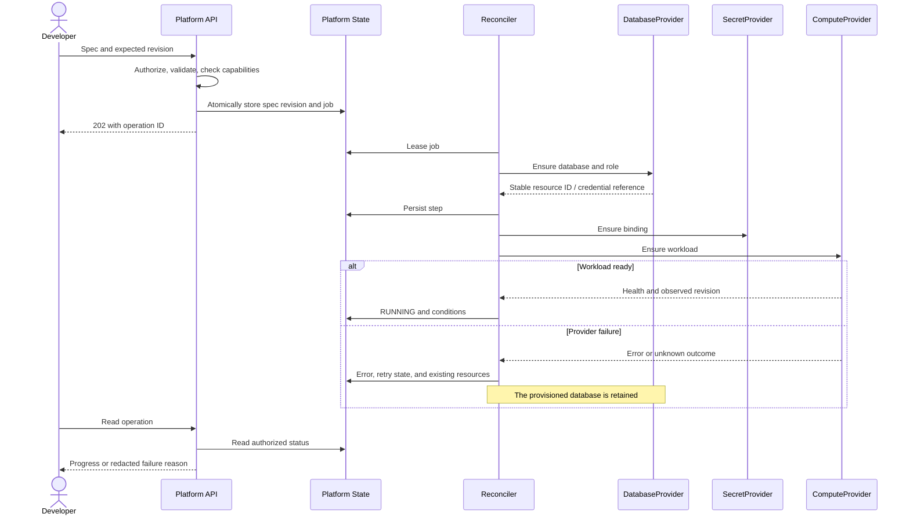

# Provisioning Sequence

Status: current request flow followed by the future asynchronous contract. [Software architecture](../software-architecture.md).

## Current synchronous PUT

```mermaid
sequenceDiagram
    actor Admin as Administrator
    participant API as FastAPI
    participant PG as PostgreSQL
    participant Files as Discovery volume
    participant K8s as Kubernetes API
    Admin->>API: PUT project spec + admin bearer token
    API->>API: Validate supported fields
    API->>PG: Acquire global session advisory lock
    API->>PG: Store latest spec / provisioning (autocommit)
    API->>Files: Publish all non-retired catalog targets
    API->>PG: Ensure project login and database
    API->>K8s: Server-side apply fixed resources
    alt All steps completed
        API->>PG: Store applied
        API->>PG: Release lock
        API-->>Admin: 200 applied, namespace and host
        Note over Admin,K8s: Rollout readiness is checked separately
    else Provisioning error
        API->>PG: Attempt to store failed and release lock
        API-->>Admin: 503; repeat the same PUT
        Note over PG,K8s: Existing resources/data remain; no automatic rollback
    end
```

Process termination can leave `provisioning`. Early dependency failures may prevent a catalog update. The monitoring-only thread periodically republishes discovery; it does not resume provisioning. Retirement separately acknowledges an already absent namespace and retains SQL/catalog data. See [ADR-012](../../03-decisions/ADR-012-admin-provisioning-baseline.md) and [ADR-014](../../03-decisions/ADR-014-catalog-availability-monitoring.md).

## Target asynchronous contract



Routing and observability are also resumable steps; they are condensed here for readability. After a timeout, the worker observes provider state before attempting creation again.
