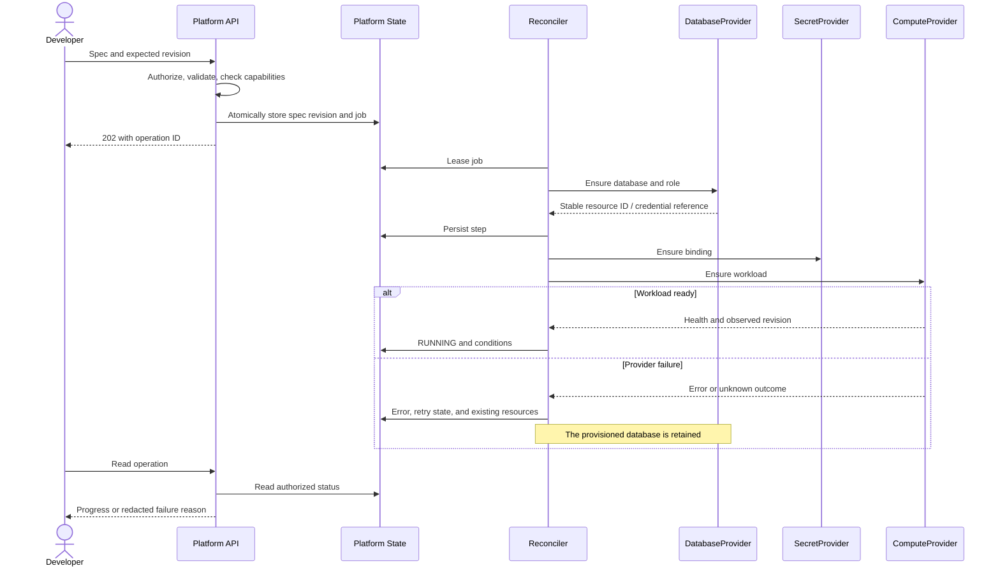

# Provisioning Sequence

Status: contract draft. [Software architecture](../software-architecture.md).

Routing and observability are also resumable steps; they are condensed here for readability. After a timeout, the worker observes provider state before attempting creation again.
