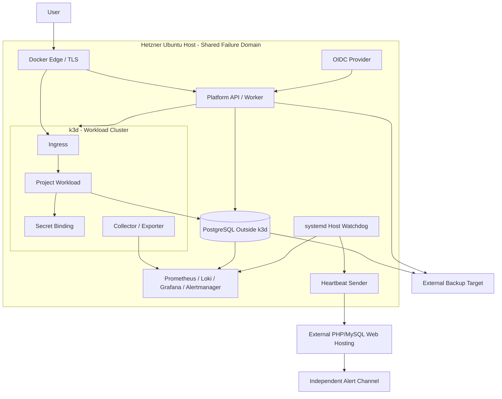

# Hybrid Topology

Status: selected installation model, shown as an architectural draft. [Details](../infrastructure.md).

Arrows to observability and backup represent logical data flows, not a complete firewall rule set. The external watchdog must run outside the monitored host. Verify network, credential, and storage separation during installation.
