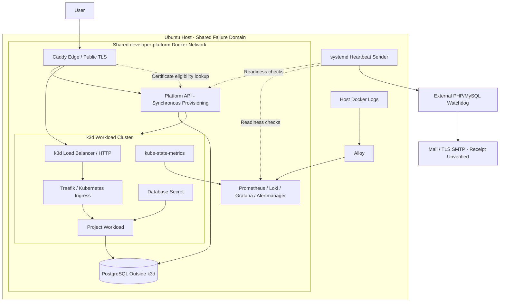

# Hybrid Topology

Status: current source topology, with Caddy edge and Traefik ingress selected in [ADR-009](../../03-decisions/ADR-009-edge-and-cluster-ingress.md). Live TLS and recovery acceptance remain open. [Infrastructure details](../infrastructure.md).

Arrows show logical flows rather than firewall rules. Caddy and shared services remain outside k3d, but all local components share one host failure domain. Public application TLS terminates at Caddy; the ingress hop is HTTP.

Separate Docker networks, the identity provider, durable worker, PostgreSQL/application telemetry, and automated encrypted external backups remain target work and are not shown as implemented components. Local SQL dumps exist but are not off-host recovery. The watchdog is independently hosted; actual installation and notification receipt still require evidence.
