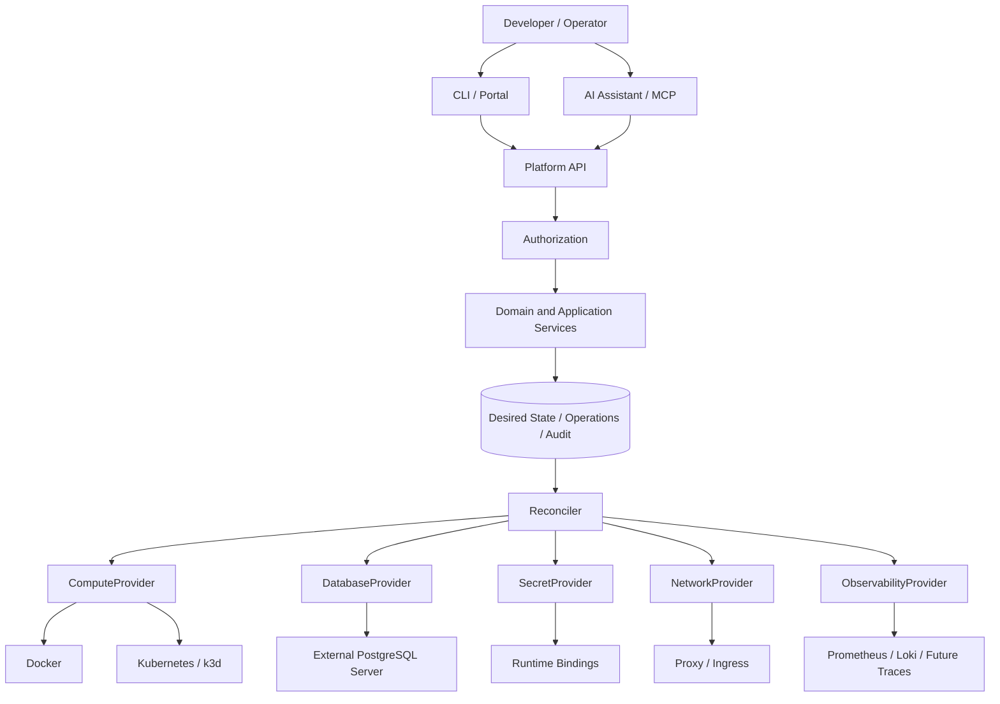

# Architecture Overview

Status: current lab summary plus target architecture. The technology-independent API is an accepted requirement; the richer domain, provider ports and worker below remain drafts.

## Implemented lab

The [FastAPI service](../../platform/app/main.py) accepts synchronous administrator PUT requests for one image, HTTP endpoint and mandatory PostgreSQL database per project. A project name also identifies its application; there are no separately addressable environments or components. It stores only the latest spec and provisioning status in PostgreSQL and directly applies Kubernetes manifests. Docker runs shared services; it is not an application compute provider.

A global PostgreSQL advisory lock serializes provisioning and retirement. Recovery requires repeating PUT; there is no durable provisioning worker, revision history or audit model. A background thread rebuilds monitoring discovery only. `applied` means resource application completed, not that the workload is ready. See [the current API guide](../../platform/README.md) and [ADR-012](../03-decisions/ADR-012-admin-provisioning-baseline.md).

## Target architecture

The diagram and domain description below describe the intended evolution, not deployed components.

## Three responsibility layers

1. **Infrastructure foundation:** hosts, Docker/Kubernetes, PostgreSQL servers, networking, edge/TLS, monitoring, and backups. Managed through installation and infrastructure as code.
2. **Platform control plane:** projects, environments, ApplicationSpec, authorization, resource lifecycle, provider selection, and status. Provisions resources on existing infrastructure.
3. **Developer experience:** API, CLI, and later a portal and AI assistant. All use the same domain operations.

## Domain boundaries

A Project owns Environments. An Application describes a logical application; a Deployment associates a revision with an Environment. Workload, Resource, and Endpoint are addressable targets. A Principal receives allowed actions through Grants.

Providers can be combined independently: Kubernetes compute can use the same external PostgreSQL instance and observability stack as Docker compute. The API does not use namespaces or Compose project names as public identities.

The initial Application consists of an OCI image, HTTP endpoint, configuration, and optional PostgreSQL binding. Multi-component applications are a later extension. Database data is independent of the workload lifecycle.

## Desired state, observed state, and limits

The API stores intent; a reconciler converges resources toward it. An accepted request is not yet a successful deployment. Status includes the observed revision, conditions, and failure reasons.

Portability covers the contract, not automatically identical availability, network isolation, or rollout guarantees. Environments report verified capabilities. Migrating persistent data remains a planned operational process.

Details: [Software architecture](software-architecture.md), [Infrastructure](infrastructure.md), [ApplicationSpec](application-spec.md), [Decisions](../03-decisions/README.md).
