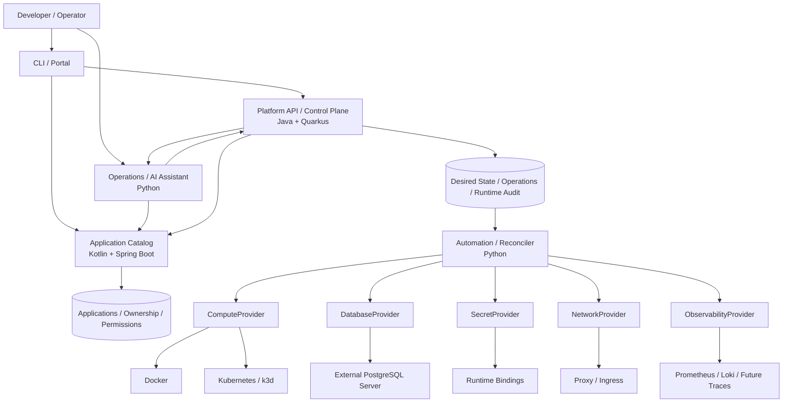

# Architecture Overview

Status: current lab summary plus target architecture. The technology-independent API and technology responsibility split are accepted directions; the richer contracts, provider ports, migrations, and worker implementation below remain drafts.

## Implemented lab

The [FastAPI service](../../platform/app/main.py) accepts synchronous administrator PUT requests for one image, HTTP endpoint and mandatory PostgreSQL database per project. A project name also identifies its application; there are no separately addressable environments or components. It stores only the latest spec and provisioning status in PostgreSQL and directly applies Kubernetes manifests. Docker runs shared services; it is not an application compute provider.

A global PostgreSQL advisory lock serializes provisioning and retirement. Recovery requires repeating PUT; there is no durable provisioning worker, revision history or audit model. A background thread rebuilds monitoring discovery only. `applied` means resource application completed, not that the workload is ready. See [the current API guide](../../platform/README.md) and [ADR-012](../03-decisions/ADR-012-admin-provisioning-baseline.md).

## Target architecture

The diagram and domain description below describe the intended evolution, not deployed components.

## Three responsibility layers

1. **Infrastructure foundation:** hosts, Docker/Kubernetes, PostgreSQL servers, networking, edge/TLS, monitoring, and backups. Managed through installation and infrastructure as code.
2. **Platform services:** an application catalog owns application metadata and permission facts; a control plane owns deployment intent, operations, provider selection, and runtime status; automation workers execute approved infrastructure steps.
3. **Developer experience:** API, CLI, and later a portal and AI assistant. They use the catalog and control-plane contracts without bypassing their ownership or authorization boundaries.

The diagram is the target service topology, not the implemented lab. The current FastAPI process still combines catalog storage, request coordination, and direct provisioning. [ADR-006](../03-decisions/ADR-006-python-quarkus-evolution.md) selects the target roles but requires contract, parity, state-migration, and rollback gates before traffic moves.

## Domain boundaries

A Project owns Environments. The catalog is authoritative for Projects, Environments, Applications, ownership, repositories, dependencies, Grants, and intended resource relationships. The control plane refers to their stable IDs and is authoritative for ApplicationSpec revisions, Deployments, Operations, provider assignments, observed runtime state, and platform events. Workload, Resource, and Endpoint are addressable runtime targets.

A catalog dependency expresses a logical relationship between applications or intended resources; it causes no infrastructure side effect. An ApplicationSpec requests the environment-specific resource and binding realization. The control plane validates that request against catalog relationships and platform policy before provisioning.

The catalog supplies permission facts; each service still authenticates the caller and enforces authorization for its own operations. The control plane must reject a deployment when the referenced catalog identity is absent, inactive, or not allowed. Services exchange versioned APIs or events and never share tables. Catalog summaries of deployment state are projections of control-plane events, not a second source of truth.

Providers can be combined independently: Kubernetes compute can use the same external PostgreSQL instance and observability stack as Docker compute. The API does not use namespaces or Compose project names as public identities.

The initial Application consists of an OCI image, HTTP endpoint, configuration, and optional PostgreSQL binding. Multi-component applications are a later extension. Database data is independent of the workload lifecycle.

## Desired state, observed state, and limits

The control-plane API stores intent; Python workers reconcile infrastructure toward it and return structured step results. A worker executes an approved plan but neither changes application ownership nor decides platform policy. An accepted request is not yet a successful deployment. Status includes the observed revision, conditions, and failure reasons.

Portability covers the contract, not automatically identical availability, network isolation, or rollout guarantees. Environments report verified capabilities. Migrating persistent data remains a planned operational process.

Details: [Software architecture](software-architecture.md), [Infrastructure](infrastructure.md), [ApplicationSpec](application-spec.md), [Decisions](../03-decisions/README.md).
