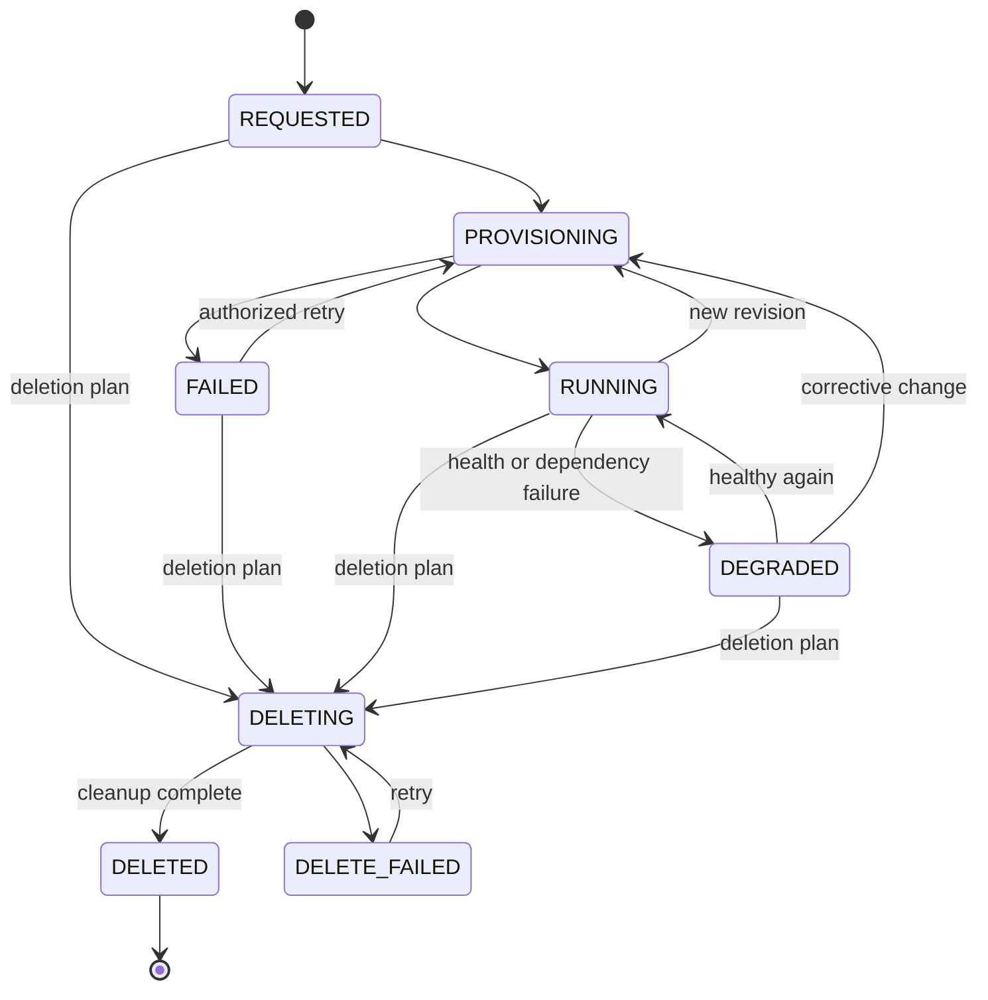

# Software Architecture

Status: target design draft. The inspected [Python API](../../platform/app/main.py) synchronously provisions PostgreSQL and Kubernetes resources and persists the latest project spec/status. The [backlog evidence](../04-development/delivery-backlog.md#evidence-conventions) records source evidence and local checks; live acceptance remains unverified. The domain modules, asynchronous operations, and provider contract below remain proposed. Quarkus and a multi-service implementation have not been selected.

## Ports and adapters

The core models Applications, Environments, Resources, Deployments, and Grants. REST, CLI, and later MCP are inbound adapters; Docker, Kubernetes, PostgreSQL, and monitoring are outbound adapters. A modular service with persistent worker state is sufficient initially; separate processes are not a domain requirement.

| Module | Responsibility |
|---|---|
| API | Authentication, input validation, versioned contract, operation status |
| Application services | Authorization, planning, capability checks, lifecycle |
| Domain | Identities, desired state, revisions, rules, references |
| State repository | Specs, provider assignments, resource IDs, jobs, audit |
| Reconciler | Resumable execution, observation, retry, drift detection |
| Provider SPI | Compute, Database, Secret, Network, Observability; later Identity |
| Adapters | Translate domain operations into infrastructure operations |

Platform metadata is logically separate from application databases. Sharing the same PostgreSQL server is an installation detail.

## Asynchronous contract

These routes are contract proposals, not an existing API:

| Operation | Example |
|---|---|
| Create/replace ApplicationSpec | `PUT /v1/projects/{project}/environments/{env}/applications/{name}` |
| Read application and status | `GET /v1/projects/{project}/environments/{env}/applications/{name}` |
| Read progress | `GET /v1/operations/{id}` |
| Read environment capabilities | `GET /v1/projects/{project}/environments/{env}/capabilities` |
| Request a controlled deletion plan | `POST /v1/projects/{project}/environments/{env}/applications/{name}/deletion-plans` |

A change atomically persists the spec revision and job, returning `202 Accepted` with an operation ID and status reference. Workers consume persisted jobs; an in-memory task alone is insufficient. Updates require an expected revision to handle concurrency. Stale revisions are rejected as conflicts.

An idempotency key is bound to the actor, scope, and request hash. The same key and content return the same operation; different content produces a conflict. Operation results must not be exposed across project boundaries.

## Reconciliation

Persisted steps and observed provider IDs prevent blind recreation. A lease or equivalent lock prevents concurrent processing of the same resource. Check the current revision before each step.

Sequence: authorize → validate → check capabilities → persist plan → ensure database/role → bind secret → ensure workload and route → observe health. See the [sequence diagram](diagrams/provisioning.md).

There is no distributed transaction across PostgreSQL provisioning, Docker, and Kubernetes. Partial failures remain visible. Retries use backoff and a retry limit; permanent validation/authorization failures are not retried indefinitely. After a timeout, resolve unknown outcomes through observation first.

## Provider contract and errors

Providers report supported features and limits per environment, not merely per product. Operations have stable domain IDs and `ensure`, `observe`, and controlled `delete` semantics.

Errors map to `ValidationFailed`, `Forbidden`, `CapabilityNotSupported`, `Conflict`, `ProviderUnavailable`, and `ProvisioningFailed`. Backend details are redacted and correlated for operators using the operation ID.

A Docker backend must not silently ignore autoscaling or multi-node availability requirements. k3d uses the Kubernetes adapter with a different installation profile; a separate domain-level k3d provider is unnecessary.

## Lifecycle and extension

Persistent resources have a retention policy independent of workloads; the default is `retain`. A deletion plan removes only resources whose ownership is established and records retained databases/volumes. Permanent data deletion requires a separate authorized step.

A second provider tests the abstraction in practice. Changing implementation language requires analysis of the existing prototype and an ADR. See [ADR-001](../03-decisions/ADR-001-platform-api-abstraction.md) and [ADR-006](../03-decisions/ADR-006-python-quarkus-evolution.md).
