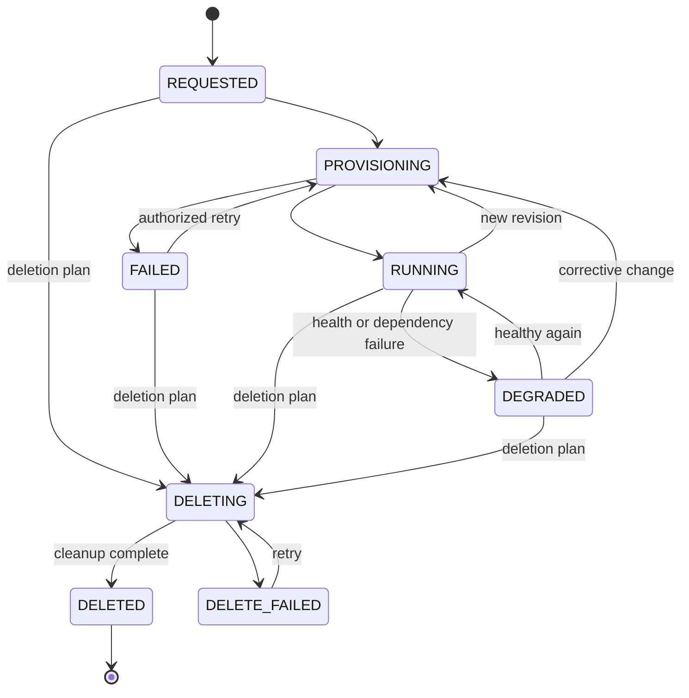

# Software Architecture

Status: accepted target service responsibilities with draft contracts and migration design. The inspected [Python API](../../platform/app/main.py) synchronously provisions PostgreSQL and Kubernetes resources and persists the latest project spec/status. The [backlog evidence](../04-development/delivery-backlog.md#evidence-conventions) records source evidence and local checks; live acceptance remains unverified. Kotlin/Spring Boot, Quarkus, Python workers, asynchronous operations, and provider ports are not yet implemented as this target topology.

## Current control plane

[ADR-012](../03-decisions/ADR-012-admin-provisioning-baseline.md) records the implemented synchronous administrator boundary. FastAPI calls PostgreSQL and the Kubernetes dynamic client directly; `manifests.py` generates fixed resources and `monitoring.py` publishes derived probe targets. There are no provider interfaces or persisted provisioning jobs.

Each PUT replaces the latest catalog spec, publishes monitoring, ensures the database/login, applies manifests with Kubernetes server-side apply, then writes `applied`. Failures can leave SQL or Kubernetes resources and a `failed`/`provisioning` catalog entry. All projects share one session advisory lock, and no expected revision prevents a later request from overwriting an earlier spec. Catalog, SQL and Kubernetes changes are not atomic together.

Retirement acknowledges prior manual namespace removal and retains the catalog/database/login; it does not perform the target deletion plan. The monitoring loop retries discovery every 30 seconds, preserving prior targets on failure; it never repairs workloads. [ADR-014](../03-decisions/ADR-014-catalog-availability-monitoring.md) records this boundary.

## Target design

## Service boundaries and ownership

The target separates three responsibilities. These are ownership boundaries, not permission to duplicate state or introduce a distributed transaction.

| Service | Technology role | Authoritative data and decisions | Explicit non-responsibilities |
|---|---|---|---|
| Application Catalog | Kotlin + Spring Boot | Projects, environments, application identity, owners, repositories, dependencies, grants, intended resource relationships | Deployment execution, provider credentials, live runtime status |
| Platform API / Control Plane | Java + Quarkus | ApplicationSpec revisions, policy/capability validation, operations, provider assignments, deployment lifecycle, observed state, platform events | Owning catalog records or embedding provider-specific automation |
| Automation and Operations | Python | Idempotent execution and observation of approved provider steps; diagnostics and operational analysis | Application ownership, authorization policy, desired-state decisions |

Catalog and control-plane data use separate schemas owned by their service. Stable IDs, versioned contracts, job identifiers, structured results, and events cross the boundary; database tables do not. The control plane may cache versioned catalog facts needed to execute an accepted operation, but the cache records provenance and is not independently editable. A deployment summary in the catalog is a projection of control-plane events.

Catalog dependencies and intended relationships are descriptive and produce no infrastructure side effect. Environment-specific resource requests and bindings belong to ApplicationSpec; the control plane validates them against the catalog facts and platform policy, then workers realize only the approved plan.

Each service authenticates callers and enforces its own authorization. The catalog owns ownership and grant facts. The control plane evaluates those facts together with platform policy at acceptance and again before material state changes. Python workers receive a bounded, immutable operation envelope and narrowly scoped infrastructure credentials; they do not receive end-user authority to reinterpret.

## Control-plane ports and adapters

Within the Quarkus control plane, REST, CLI, and later MCP are inbound adapters; the catalog client, job dispatch, Docker, Kubernetes, PostgreSQL, and monitoring contracts are outbound ports. Concrete infrastructure adapters run in Python workers. Keeping these ports technology-independent protects the public contract and permits staged migration from the current FastAPI process.

| Module | Responsibility |
|---|---|
| API | Authentication, input validation, versioned contract, operation status |
| Application services | Authorization enforcement, planning, capability checks, lifecycle |
| Domain | Catalog references, desired state, revisions, rules, runtime references |
| State repository | Specs, provider assignments, resource IDs, jobs, audit |
| Job coordinator | Dispatch, leases, resumable steps, retry, drift decisions |
| Provider SPI | Technology-neutral Compute, Database, Secret, Network, Observability operations |
| Worker adapters | Python translations from approved operations to infrastructure integrations |

Catalog metadata, control-plane state, and hosted application databases are logically separate. Sharing the same PostgreSQL server is an installation detail, not permission to share schemas or database access.

## Asynchronous contract

These routes are contract proposals, not an existing API. Catalog routes manage application identity and ownership; control-plane routes manage deployment intent and operations.

| Operation | Example |
|---|---|
| Create/update catalog application metadata | `PUT /v1/projects/{project}/applications/{name}` |
| Read catalog environment and permission facts | `GET /v1/projects/{project}/environments/{env}` |
| Create/replace ApplicationSpec | `PUT /v1/projects/{project}/environments/{env}/applications/{name}` |
| Read deployment and runtime status | `GET /v1/projects/{project}/environments/{env}/applications/{name}` |
| Read progress | `GET /v1/operations/{id}` |
| Read environment capabilities | `GET /v1/projects/{project}/environments/{env}/capabilities` |
| Request a controlled deletion plan | `POST /v1/projects/{project}/environments/{env}/applications/{name}/deletion-plans` |

A control-plane change resolves stable catalog IDs and an authorization snapshot, then atomically persists the spec revision and job, returning `202 Accepted` with an operation ID and status reference. Python workers consume persisted jobs through a versioned dispatch/result contract; an in-memory task alone is insufficient. Updates require an expected revision to handle concurrency. Stale revisions are rejected as conflicts.

An idempotency key is bound to the actor, scope, and request hash. The same key and content return the same operation; different content produces a conflict. Operation results must not be exposed across project boundaries.

## Reconciliation

Persisted steps and observed provider IDs prevent blind recreation. A lease or equivalent lock prevents concurrent processing of the same resource. Check the current revision before each step.

Sequence: authenticate → resolve catalog identity and permission facts → authorize → validate platform policy/capabilities → persist plan → dispatch bounded Python job → ensure database/role → bind secret → ensure workload and route → observe health → record result and publish event. See the [sequence diagram](diagrams/provisioning.md).

There is no distributed transaction across PostgreSQL provisioning, Docker, and Kubernetes. Partial failures remain visible. Retries use backoff and a retry limit; permanent validation/authorization failures are not retried indefinitely. After a timeout, resolve unknown outcomes through observation first.

## Provider contract and errors

Providers report supported features and limits per environment, not merely per product. Operations have stable domain IDs and `ensure`, `observe`, and controlled `delete` semantics.

Errors map to `ValidationFailed`, `Forbidden`, `CapabilityNotSupported`, `Conflict`, `ProviderUnavailable`, and `ProvisioningFailed`. Backend details are redacted and correlated for operators using the operation ID.

A Docker backend must not silently ignore autoscaling or multi-node availability requirements. k3d uses the Kubernetes adapter with a different installation profile; a separate domain-level k3d provider is unnecessary.

## Lifecycle and extension

Persistent resources have a retention policy independent of workloads; the default is `retain`. A deletion plan removes only resources whose ownership is established and records retained databases/volumes. Permanent data deletion requires a separate authorized step.

A second provider tests the abstraction in practice. The polyglot target does not authorize a big-bang rewrite: catalog extraction, control-plane parity, worker dispatch, state migration, credential separation, observability, and rollback each require explicit gates. See [ADR-001](../03-decisions/ADR-001-platform-api-abstraction.md), [ADR-006](../03-decisions/ADR-006-python-quarkus-evolution.md), and the [development plan](../04-development/development-plan.md#technology-transition).
