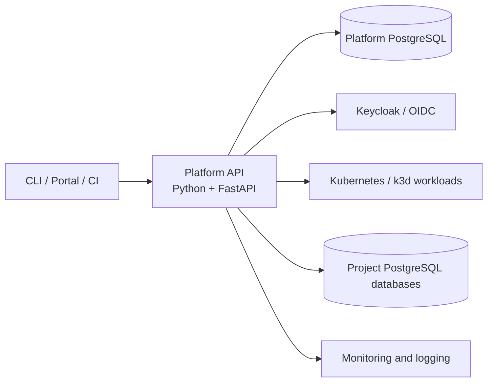

# Developer Platform: Technology Roles

Status: the selected implementation through Phase 4 is one Python/FastAPI Platform API application. The former Kotlin/Spring, Java/Quarkus, and separately deployed Python-worker split is an optional Phase 5 expansion.

## Current architecture

Python owns the complete platform application: public APIs, application metadata, grants, deployment credentials, desired revisions, durable operations, policy, Kubernetes execution, PostgreSQL provisioning, observation, diagnostics, and audit. Work remains separated into modules with explicit responsibilities, but all modules share one deployment and application lifecycle.

The single-application choice avoids inter-service authentication, distributed transactions, cross-service availability dependencies, state migration, and additional operational overhead. API and module boundaries must still remain clear enough to support testing and safe evolution.

## Supporting technologies

Kubernetes/k3d is the only application workload environment. PostgreSQL stores platform state and project databases. Keycloak supplies OIDC identities while the platform remains authoritative for grants. Caddy, Traefik, Prometheus, Loki, Grafana, and Alertmanager provide routing and observability around the Python application and workloads.

Docker hosts these platform components but is not a second application compute provider.

The Phase 3 browser portal is a React and TypeScript client of the same public
Platform API. Vite builds it; React Router owns navigation; TanStack Query owns
remote state; OpenAPI-generated types and `openapi-fetch` define its contract
boundary; and shadcn components over Base UI and Tailwind provide the UI layer. It
does not own authorization or platform lifecycle state. See
[ADR-019](../03-decisions/ADR-019-react-ui-technology-stack.md).

## Optional evolution

If an explicit need justifies independently deploying a responsibility, [optional Phase 5](../04-development/phase-5-optional-architecture-expansion.md) retains a candidate allocation:

- Kotlin/Spring Boot for an extracted application catalog;
- Java/Quarkus for an extracted control plane;
- Python for separately deployed infrastructure workers.

That allocation is not a target that current work should prepare by adding network boundaries prematurely. Each extraction must independently justify its cost and pass migration, behavior-parity, authorization, audit, recovery, and rollback gates.
