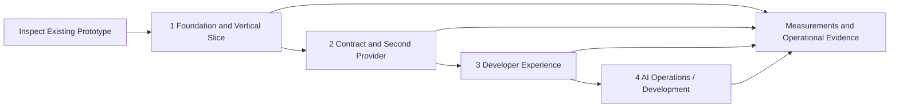

# Development Plan and Architectural Evolution

As of September 25, 2026. Future phases are proposals without confirmed dates.

## Architectural evolution

| Date | Milestone | Significance |
|---|---|---|
| September 19, 2026 | Self-service, capabilities, labs; Kubernetes with an external PostgreSQL service | Product scope and initial infrastructure boundaries |
| September 20, 2026 | Security assessments, monitoring outside the cluster, five-VM option, PHP/MySQL watchdog | Failure boundaries and operational requirements |
| September 21, 2026 | Hybrid topology selected for the existing single host | Revised starting topology; deployment not verified |
| September 21, 2026 | Automatic database secrets identified as existing behavior; separate human access proposed | Implementation baseline and next access-management extension |
| September 21, 2026 | MVP vertical slice defined; Python baseline established and Quarkus considered | Inspect the prototype before any rewrite |
| September 23, 2026 | Identity and role management for platform and hosted applications | Proposed IAM model |
| September 24, 2026 | UI/API deployment options and technology-independent Platform API | Shared contract and provider abstraction |
| September 24, 2026 | AI focus on operations/development; ApplicationSpec defined | Extensions above the same API |
| September 25, 2026 | Structured documentation established | Separate architecture, decisions, and planning |

## Implementation status

Reported baseline: an initial Python implementation and automatic database credentials exposed through Kubernetes Secrets. This workspace contains no implementation code. Installation, tests, and deployments are therefore **unverified**.

The Markdown specification is the currently verifiable artifact. It does not mark any of the following phases as complete.

## Work sequence and gates

| Phase | Entry condition | Outcome / dependency |
|---|---|---|
| [1](phase-1-foundation.md) | Access to actual code and target host | Hybrid foundation, minimal API/CLI flow, backup, and alert channel |
| [2](phase-2-platform-api.md) | Reproducible vertical slice | Stable spec/provider contract and direct Docker path |
| [3](phase-3-developer-experience.md) | Reliable lifecycle and authorization | Portal, templates, human database access, application OIDC |
| [4](phase-4-ai-operations.md) | Access-controlled data and deployment history | Evidence-based assistance and controlled actions |

Basic access enforcement, audit, secrets, and observability start in Phase 1. Phase 3 extends these capabilities rather than removing them from the MVP.

## Open decisions and ownership

| Topic | Next step | Gate |
|---|---|---|
| Actual prototype and operational state | Inventory repository and existing resources | Before implementation planning |
| Python / Quarkus | Decide ADR-006 using code and effort analysis | Phase 2 |
| Identity provider, roles, and realm model | Explicitly accept the detailed ADR-004 approach | Minimal IAM in Phase 1; expansion in Phase 3 |
| Schema reuse | Fit-gap assessment of candidate projects | Before stabilizing v1 |
| Domains, versions, storage, alert recipients | Complete the installation profile | Before first deployment |
| RPO/RTO, retention, capacity | Measure baselines and establish targets | Before production-like acceptance |

The project owner decides scope and ADRs; implementation and operations provide evidence. Specific people, dates, and capacity commitments remain unassigned.

## Recording progress

For each completed work package, record the date, repository revision, environment, test/demo results, and remaining limitations. Update the roadmap and ADR when scope changes. A requested or generated artifact alone does not prove an operational system.
