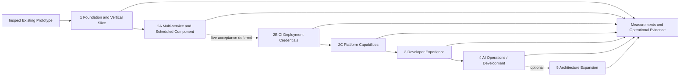

# Development Plan and Architectural Evolution

As of October 4, 2026. Future phases are proposals without confirmed dates.

## Architectural evolution

| Date | Milestone | Significance |
|---|---|---|
| September 19, 2026 | Self-service, capabilities, labs; Kubernetes with an external PostgreSQL service | Product scope and initial infrastructure boundaries |
| September 20, 2026 | Security assessments, monitoring outside the cluster, five-VM option, PHP/MySQL watchdog | Failure boundaries and operational requirements |
| September 21, 2026 | Hybrid topology selected for the existing single host | Revised starting topology; deployment not verified |
| September 21, 2026 | Automatic database secrets identified as existing behavior; separate human access proposed | Implementation baseline and next access-management extension |
| September 21, 2026 | MVP vertical slice defined; Python baseline established and Quarkus considered | Inspect the prototype before any rewrite |
| September 23, 2026 | Identity and role management for platform and hosted applications | Proposed IAM model |
| September 24, 2026 | UI/API deployment options and technology-independent Platform API | Shared contract and provider abstraction |
| September 24, 2026 | AI focus on operations/development; ApplicationSpec defined | Extensions above the same API |
| September 25, 2026 | Structured documentation established | Separate architecture, decisions, and planning |
| October 1, 2026 | Kotlin/Spring catalog, Quarkus control plane, and Python automation roles selected | Target ownership boundaries accepted; staged implementation and migration remain open |
| October 2, 2026 | Generic OIDC boundary accepted with Keycloak as the supported lab reference | Platform-owned project grants and Phase 1B roles selected, implemented, and accepted under the recorded owner-directed alert-delivery exception |
| October 4, 2026 | Multi-service application with a cron-triggered component prioritized | F-13 and UC-07 added; versioned contract, migration, internal discovery, scheduled-run status, and Kubernetes acceptance are the next Phase 2A increment |
| October 4, 2026 | Revocable CI deployment credentials prioritized after multi-service support | F-14, UC-08, and ADR-018 added; scoped OIDC machine credentials and immediate platform revocation form Phase 2B; former Phase 2B work moves to 2C |
| October 4, 2026 | Empty-project and machine-driven platform acceptance added to Phase 2B | F-15 and UC-09 add human-bootstrapped test-runner credentials, temporary role personas, and first deployment by CI after empty-project creation |
| October 4, 2026 | Current runtime architecture retained | Phase 2C remains on the existing Kubernetes infrastructure and single Python/FastAPI application; a Docker compute adapter and polyglot service split move to optional Phase 5 |

## Implementation status

The [delivery backlog](delivery-backlog.md#evidence-conventions) is the source of truth for task status, implementation findings and acceptance evidence. Its imported September 26 baseline records a partial administrator-operated foundation. Phase 1A is complete under the accepted limitations in ADR-011, ADR-016, and ADR-017; Phase 1B is complete under its recorded owner-directed alert-delivery exception; Phase 1C is complete under the limits recorded in its October 3 gate audit. Phase 2A source implementation exists but its live acceptance is deferred by owner direction. Phase 2B source implementation also exists and its deployed acceptance remains open; this sequencing exception does not mark Phase 2A accepted. Phase 2C and all later gates remain open. The current delivery architecture remains the existing Kubernetes provider and one Python/FastAPI API application. Consult task notes and the verification register for revisions, environments and limits.

## Work sequence and gates

| Phase | Entry condition | Outcome / dependency |
|---|---|---|
| [1](phase-1-foundation.md) | Access to actual code and target host | 1A operational protection, 1B accountable access/security alerts, 1C durable lifecycle and minimal API/CLI, with internal ownership seams in the Python application |
| [2A](phase-2a-multi-service-scheduled-application.md) | Accepted Phase 1 vertical slice | Versioned multi-service contract; internal discovery; independently observable long-running services and cron-triggered component on Kubernetes; lossless single-component migration |
| [2B](phase-2b-ci-deployment-credentials.md) | IAM boundary; Phase 2A live gate explicitly deferred by owner | Empty-project bootstrap; scoped deployment credentials; human-created test runner and temporary role personas; machine-driven deploy/observe and authorization suite; immediate platform denial and redacted audit evidence |
| [2C](phase-2c-platform-capabilities.md) | Accepted Phase 2A and 2B vertical slices | Diagnostics, policy, scaling, connectivity, recovery, and retirement on the current Kubernetes provider and single Python API |
| [3](phase-3-developer-experience.md) | Reliable lifecycle, authorization, and stable public contracts from Phase 2C | Portal, templates, human database access, and application OIDC through the Python Platform API |
| [4](phase-4-ai-operations.md) | Access-controlled data and deployment history | Python-based evidence assistance and controlled actions through the Platform API |
| [5](phase-5-optional-architecture-expansion.md) | Optional owner decision after Phase 4; demonstrated need for another compute provider or service boundary | Optional Docker compute adapter and/or polyglot service extraction, each gated by parity, migration, rollback, and operational evidence |

**Phase 1 is the MVP (minimum viable product)** and includes gates 1A, 1B and 1C. Requirement delivery phases labeled “Phase 1 (MVP)” must meet their acceptance minimum by that phase’s exit; later extensions do not defer it.

Basic access enforcement, audit, secrets, and observability start in Phase 1. Phase 3 extends these capabilities rather than removing them from the MVP.

## Current architecture and optional expansion

The selected delivery architecture through Phase 4 is one Python/FastAPI API application using the existing Kubernetes/k3d workload infrastructure. Logical responsibility boundaries remain useful inside that application, but they do not imply separately deployed catalog, control-plane, or worker services. No additional compute adapter is required for current acceptance.

[ADR-001](../03-decisions/ADR-001-platform-api-abstraction.md), [ADR-002](../03-decisions/ADR-002-docker-vs-kubernetes.md), and [ADR-006](../03-decisions/ADR-006-python-quarkus-evolution.md) retain the former expansion design as an optional Phase 5 direction. If the owner activates that phase, it follows these gates:

| Gate | Phase | Required result |
|---|---|---|
| Logical seams | Existing baseline | Stable IDs, grants, deployment revisions, operations, provider execution, and observed state remain logically separated within the Python codebase. Persisted jobs use a versioned envelope/result model. |
| Need and scope decision | Optional Phase 5 entry | Record the concrete limitation that justifies another provider or deployable service and choose only the required expansion package. |
| Catalog extraction | Optional Phase 5 | If selected, Kotlin/Spring Boot owns migrated application metadata and grants only after reconciliation, authorization, backup/restore, and rollback pass. |
| Control-plane migration | Optional Phase 5 | If selected, Quarkus passes public-contract and behavior parity before traffic moves. |
| Worker separation | Optional Phase 5 | If selected, separately deployed Python workers pass interruption, duplicate-delivery, stale-authorization, timeout, and redaction acceptance. |
| Provider portability | Optional Phase 5 | If selected, Kubernetes and Docker adapters pass the same provider contract and end-to-end lifecycle evidence. |

Use one authoritative writer per data type at every migration step. Prefer backfill, compare, cut over, and retain a bounded rollback path over permanent dual writes. Correlate actor, catalog version, desired revision, operation ID, job ID, and provider resource IDs across services. Extend monitoring and recovery coverage before retiring the corresponding FastAPI path.

## Backlog delivery commitments

The [delivery backlog](delivery-backlog.md) preserves all 20 permanent DEV/OPS IDs and their acceptance criteria. Its [phase task index](delivery-backlog.md#phase-task-index) assigns independently checkable tasks to one gate each, including provider, developer-experience and AI work. Stories may span gates; task completion and story completion are recorded separately. This plan supersedes the former six-milestone plan. No story is dropped or marked complete by this amendment.

Deliver Phase 1 in order: **1A operational protection → 1B accountable access → 1C durable single-application lifecycle**. Phase 1 is complete under its recorded limits. Deliver **2A multi-service and scheduled component next**, then **2B CI deployment credentials**, before continuing the remaining Phase 2C capability backlog. Phase 3 and Phase 4 depend on those demonstrated outcomes. Optional Phase 5 does not gate them.

The table assigns delivery responsibility by role; named delivery owners, dates, and capacity remain unassigned. Alert response is assigned to the project owner under the lab response policy. Assign a named owner before starting each package. Every row is open. A single-image slice does not close criteria that require multiple components.

| Story | Requirement mapping | Delivery gate and disposition | Accountable role |
|---|---|---|---|
| DEV-001 | F-02/F-13 | Phase 2A next: versioned named-component contract, stable internal discovery, independent updates/status, and a non-overlapping cron-triggered component | Product / API |
| DEV-002 | F-02, N-02 | 1C configuration CRUD/activation for one component; per-component extension deferred | API |
| DEV-003 | N-03/N-04 | 1C secret CRUD/rotation/adoption; per-component extension deferred | API / security |
| DEV-004 | F-06, N-03 | Phase 2C diagnostics: authorized search/follow and terminated-instance retention; Phase 2A adds basic scheduled-run attribution | Observability |
| DEV-005 | F-06, N-07 | Phase 2C diagnostics: inventory and usage/request/limit/quota comparisons | Observability |
| DEV-006 | F-04/F-06/F-13 | 1C observed rollout/health for one component; Phase 2A per-component and scheduled-run reporting | API |
| DEV-007 | F-04/F-05, N-02 | 1C durable retry; Phase 2C retained-revision recovery and dependency checks | API |
| DEV-008 | F-02/F-08, N-07 | Phase 2C scaling/quota/scheduling acceptance; advanced per-component allocation deferred | API / infrastructure |
| DEV-009 | F-02/F-08, N-03 | Phase 2C public/private transitions, TLS and outbound policy; advanced per-component policy deferred | Networking |
| DEV-010 | F-03, N-03/N-05 | 1C binding/preservation; Phase 2C availability and tracked operator recovery requests | API / operations |
| DEV-011 | F-05/F-13, N-02/N-08 | 1C confirmed application removal with retained data; Phase 2A all-component retirement preview/cleanup | API |
| DEV-012 | F-14/F-15, N-03/N-04/N-08 | Phase 2B: empty-project bootstrap plus scoped deployment and test-automation OIDC identities with expiry, rotation, immediate revocation, and machine-driven acceptance | API / security |
| OPS-001 | N-08 | 1B durable audit, inspection, restricted filtering/export and retention | Security |
| OPS-002 | N-06/N-08 extension | 1B configurable security alerts with evidence and tested delivery | Security / operations |
| OPS-003 | N-07, F-06 | Phase 2C host/shared-service/project capacity views and alerts; representative Phase 2A capacity measurement and 1C baseline | Operations |
| OPS-004 | F-01, N-03/N-08 | 1B individual access, roles, revocation; recheck every new data surface | Security / API |
| OPS-005 | F-08, N-03/N-07 | Phase 2C configurable quotas/policy, impact preview and aggregate admission | Infrastructure |
| OPS-006 | N-05 | 1A scheduled encrypted off-host backups and measured isolated restoration; repeat as state grows | Operations |
| OPS-007 | N-06, F-06 | 1A independent failure signals; Phase 2C current-platform coverage and project impact | Operations |
| OPS-008 | F-01/F-05, N-02/N-08 extension | Phase 2C project retirement after reliable deletion, retention inventory and access revocation | API / operations |

Multi-service support is no longer deferred. [Phase 2A](phase-2a-multi-service-scheduled-application.md) is the next gate and must pass before [Phase 2B CI credentials](phase-2b-ci-deployment-credentials.md), which in turn gates the remaining Phase 2C work. The component change uses a successor schema and explicit migration; do not silently transform the existing singular application object or claim acceptance from single-image tests. CI acceptance must use a distinct machine identity rather than a developer token. All three Phase 2 increments stay on the existing Kubernetes infrastructure and in the single Python API application.

Human database access, hosted-application OIDC, and AI remain later additions. Docker portability and the polyglot service split are optional Phase 5 packages and do not gate those additions. No calendar or effort commitments are implied.

## Lab validation constraint

[ADR-010](../03-decisions/ADR-010-single-environment-lab.md) records the owner’s accepted single-environment lab policy. Continue operational checks on the existing platform and external watchdog with explicit impact and recovery steps. Do not provision additional test environments. [ADR-016](../03-decisions/ADR-016-phase-1a-recovery-scope.md) omits new isolated restore exercises and recurring full-restoration scheduling from Phase 1A; existing evidence remains historical reference material.

[ADR-011](../03-decisions/ADR-011-watchdog-monitoring-boundary.md) bounds monitoring at the existing external watchdog. Independent detection of its scheduler/hosting failure is excluded from Phase 1A acceptance, with silent failure explicitly accepted by the owner. This is a scope decision, not a passed test or deferred implementation; other monitoring criteria remain required.

## Open decisions and ownership

| Topic | Next step | Gate |
|---|---|---|
| Operational state and acceptance | Use the inspected source baseline in the [backlog evidence](delivery-backlog.md#evidence-conventions); inventory live resources and record acceptance exercises | Phase 1 |
| Multi-service scheduled application | Finalize the successor schema, migration/rollback and capacity result; implement and run UC-07 on Kubernetes | Phase 2A (next) |
| CI deployment credentials | Finalize expiry/rotation policy and OIDC credential integration; implement and run UC-08 with immediate platform revocation evidence | Phase 2B |
| Optional architecture expansion | Keep the single Python API and Kubernetes provider unless a concrete need justifies activating adapter or service-extraction work | Optional Phase 5 |
| Schema reuse | Fit-gap assessment of candidate projects | Before stabilizing v1 |
| Domains, versions, storage, alert recipients | Keep the deployed profile and source defaults explicit; capture exact live revision and recipient evidence | Before installation changes |
| RPO/RTO, retention, capacity | Backup policy is selected (24-hour RPO, four-hour RTO, 14/8/6 retention); [ADR-017](../03-decisions/ADR-017-phase-1a-retention-evidence-scope.md) omits full-horizon retention evidence from Phase 1A, so measure recovery, retention, and capacity against targets | Before production-like acceptance |

[ADR-004](../03-decisions/ADR-004-identity-and-access-management.md) resolves the identity-provider, Phase 1B role and realm-model decision: use a generic OIDC contract, Keycloak as the supported lab reference, and platform-owned project grants. Implementation and acceptance remain OPS-001/002/004 work; hosted-application client automation and richer access experience remain Phase 3 work.

The project owner decides scope and ADRs; implementation and operations provide evidence. Specific delivery owners, dates, and capacity commitments remain unassigned; the project owner is the sole alert responder.

## Recording progress

For each completed work package and story criterion, record the date, repository revision, environment, test/demo results, and remaining limitations. Record and link evidence beside the relevant backlog task before closing a story; all its acceptance criteria must pass, including any deferred component-specific criteria. Record partial slices separately. Recheck authorization/audit and backup coverage whenever new endpoints, secrets, identities, revisions, or inventories are introduced. Update the roadmap and ADR when scope changes. A requested or generated artifact alone does not prove an operational system.
