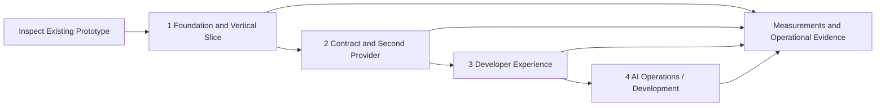

# Development Plan and Architectural Evolution

As of September 27, 2026. Future phases are proposals without confirmed dates.

## Architectural evolution

| Date | Milestone | Significance |
|---|---|---|
| September 19, 2026 | Self-service, capabilities, labs; Kubernetes with an external PostgreSQL service | Product scope and initial infrastructure boundaries |
| September 20, 2026 | Security assessments, monitoring outside the cluster, five-VM option, PHP/MySQL watchdog | Failure boundaries and operational requirements |
| September 21, 2026 | Hybrid topology selected for the existing single host | Revised starting topology; deployment not verified |
| September 21, 2026 | Automatic database secrets identified as existing behavior; separate human access proposed | Implementation baseline and next access-management extension |
| September 21, 2026 | MVP vertical slice defined; Python baseline established and Quarkus considered | Inspect the prototype before any rewrite |
| September 23, 2026 | Identity and role management for platform and hosted applications | Proposed IAM model |
| September 24, 2026 | UI/API deployment options and technology-independent Platform API | Shared contract and provider abstraction |
| September 24, 2026 | AI focus on operations/development; ApplicationSpec defined | Extensions above the same API |
| September 25, 2026 | Structured documentation established | Separate architecture, decisions, and planning |

## Implementation status

The [delivery backlog](delivery-backlog.md#evidence-conventions) is the source of truth for task status, implementation findings and acceptance evidence. Its imported September 26 baseline records a partial administrator-operated foundation; no phase has acceptance evidence establishing completion. Consult task notes and the verification register for revisions, environments and limits. This plan owns sequencing, not a separate implementation assessment. Current Phase 1A criterion-level progress is recorded under [backup and recovery](delivery-backlog.md#current-backup-and-recovery-progress) and [monitoring](delivery-backlog.md#current-monitoring-progress); successful drills do not close their remaining acceptance gates.

## Work sequence and gates

| Phase | Entry condition | Outcome / dependency |
|---|---|---|
| [1](phase-1-foundation.md) | Access to actual code and target host | 1A operational protection, 1B accountable access/security alerts, 1C durable lifecycle and minimal API/CLI |
| [2](phase-2-platform-api.md) | Reproducible vertical slice | Retained diagnostics/policy/recovery/retirement packages, stable contract and direct Docker parity |
| [3](phase-3-developer-experience.md) | Reliable lifecycle and authorization | Portal, templates, human database access, application OIDC |
| [4](phase-4-ai-operations.md) | Access-controlled data and deployment history | Evidence-based assistance and controlled actions |

**Phase 1 is the MVP (minimum viable product)** and includes gates 1A, 1B and 1C. Requirement delivery phases labeled “Phase 1 (MVP)” must meet their acceptance minimum by that phase’s exit; later extensions do not defer it.

Basic access enforcement, audit, secrets, and observability start in Phase 1. Phase 3 extends these capabilities rather than removing them from the MVP.

## Backlog delivery commitments

The [delivery backlog](delivery-backlog.md) preserves all 19 permanent DEV/OPS IDs and their acceptance criteria. Its [phase task index](delivery-backlog.md#phase-task-index) assigns independently checkable tasks to one gate each, including provider, developer-experience and AI work. Stories may span gates; task completion and story completion are recorded separately. This plan supersedes the former six-milestone plan. No story is dropped or marked complete by this amendment.

Deliver Phase 1 in order: **1A operational protection → 1B accountable access → 1C durable single-application lifecycle**. Design and local implementation may overlap, but do not release expanded self-service before 1A and 1B pass. Phase 2 completes the retained single-image backlog and safe project retirement before the second-provider acceptance gate. Phase 3 and Phase 4 depend on those demonstrated outcomes.

The table assigns delivery responsibility by role; named delivery owners, dates, and capacity remain unassigned. Alert response is assigned to the project owner under the lab response policy. Assign a named owner before starting each package. Every row is open. A single-image slice does not close criteria that require multiple components.

| Story | Requirement mapping | Delivery gate and disposition | Accountable role |
|---|---|---|---|
| DEV-001 | F-02/F-07 extension | Deferred multi-component contract and implementation; Phase 3 design review, then explicit scheduling decision | Product / API |
| DEV-002 | F-02, N-02 | 1C configuration CRUD/activation for one component; per-component extension deferred | API |
| DEV-003 | N-03/N-04 | 1C secret CRUD/rotation/adoption; per-component extension deferred | API / security |
| DEV-004 | F-06, N-03 | Phase 2 diagnostics: authorized search/follow, terminated-instance retention; basic logs in 1C | Observability |
| DEV-005 | F-06, N-07 | Phase 2 diagnostics: inventory and usage/request/limit/quota comparisons | Observability |
| DEV-006 | F-04/F-06 | 1C observed rollout/health for one component; multi-component reporting deferred | API |
| DEV-007 | F-04/F-05, N-02 | 1C durable retry; Phase 2 retained-revision recovery and dependency checks | API |
| DEV-008 | F-02/F-08, N-07 | Phase 2 scaling/quota/scheduling acceptance; per-component extension deferred | API / infrastructure |
| DEV-009 | F-02/F-08, N-03 | Phase 2 public/private transitions, TLS and outbound policy; per-component extension deferred | Networking |
| DEV-010 | F-03, N-03/N-05 | 1C binding/preservation; Phase 2 availability and tracked operator recovery requests | API / operations |
| DEV-011 | F-05, N-02/N-08 | 1C confirmed application removal with retained data; multi-component preview extension deferred | API |
| OPS-001 | N-08 | 1B durable audit, inspection, restricted filtering/export and retention | Security |
| OPS-002 | N-06/N-08 extension | 1B configurable security alerts with evidence and tested delivery | Security / operations |
| OPS-003 | N-07, F-06 | Phase 2 host/shared-service/project capacity views and alerts; baseline measurement in 1C | Operations |
| OPS-004 | F-01, N-03/N-08 | 1B individual access, roles, revocation; recheck every new data surface | Security / API |
| OPS-005 | F-08, N-03/N-07 | Phase 2 configurable quotas/policy, impact preview and aggregate admission | Infrastructure |
| OPS-006 | N-05 | 1A scheduled encrypted off-host backups and measured isolated restoration; repeat as state grows | Operations |
| OPS-007 | N-06, F-06 | 1A independent failure signals; Phase 2 full service coverage and project impact | Operations |
| OPS-008 | F-01/F-05, N-02/N-08 extension | Phase 2 project retirement after reliable deletion, retention inventory and access revocation | API / operations |

Multi-component support remains deferred from the single-image MVP and Phase 2 portability contract. At Phase 3 entry, review a concrete multi-component use case, capacity evidence, independent-update semantics, and a versioned migration design; the project owner then schedules implementation or records continued deferral with a next review trigger. Do not silently transform the existing schema or close affected stories based on single-image tests.

Docker portability, human database access, hosted-application OIDC, and AI are additions to this backlog. Retain their phases, but review priority against open story criteria at each gate. No calendar or effort commitments are implied.

## Lab validation constraint

[ADR-010](../03-decisions/ADR-010-single-environment-lab.md) records the owner’s accepted single-environment lab policy. Continue operational checks on the existing platform and external watchdog with explicit impact and recovery steps. Do not provision additional test environments. Existing isolated restore evidence is retained; new empty-host restore exercises are deferred and their outstanding acceptance criteria remain open.

[ADR-011](../03-decisions/ADR-011-watchdog-monitoring-boundary.md) bounds monitoring at the existing external watchdog. Independent detection of its scheduler/hosting failure is excluded from Phase 1A acceptance, with silent failure explicitly accepted by the owner. This is a scope decision, not a passed test or deferred implementation; other monitoring criteria remain required.

## Open decisions and ownership

| Topic | Next step | Gate |
|---|---|---|
| Operational state and acceptance | Use the inspected source baseline in the [backlog evidence](delivery-backlog.md#evidence-conventions); inventory live resources and record acceptance exercises | Phase 1 |
| Python / Quarkus | Decide ADR-006 using code and effort analysis | Phase 2 |
| Identity provider, roles, and realm model | Explicitly accept the detailed ADR-004 approach | Minimal IAM in Phase 1; expansion in Phase 3 |
| Schema reuse | Fit-gap assessment of candidate projects | Before stabilizing v1 |
| Domains, versions, storage, alert recipients | Keep the deployed profile and source defaults explicit; capture exact live revision and recipient evidence | Before installation changes |
| RPO/RTO, retention, capacity | Backup policy is selected (24-hour RPO, four-hour RTO, 14/8/6 retention); measure recovery and capacity against targets | Before production-like acceptance |

The project owner decides scope and ADRs; implementation and operations provide evidence. Specific delivery owners, dates, and capacity commitments remain unassigned; the project owner is the sole alert responder.

## Recording progress

For each completed work package and story criterion, record the date, repository revision, environment, test/demo results, and remaining limitations. Record and link evidence beside the relevant backlog task before closing a story; all its acceptance criteria must pass, including any deferred component-specific criteria. Record partial slices separately. Recheck authorization/audit and backup coverage whenever new endpoints, secrets, identities, revisions, or inventories are introduced. Update the roadmap and ADR when scope changes. A requested or generated artifact alone does not prove an operational system.
