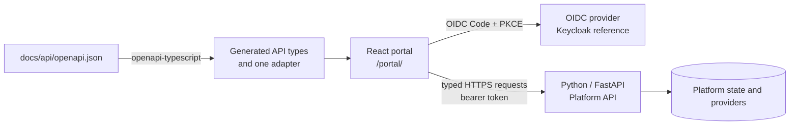

# Platform UI Implementation Plan

Status: in progress as of October 7, 2026. Foundation, the authentication boundary,
the project workspace, and the core developer lifecycle are implemented in source:
project creation, deployment and operation polling, diagnostics, logs, configuration,
secrets, restart, rollback, retirement, recovery requests, and deployment
credentials. Project-grant management is also implemented; operator workflows and
delivery hardening remain planned. This plan implements the React stack selected
in [ADR-019](../03-decisions/ADR-019-react-ui-technology-stack.md) for the Phase 3
Platform Control Plane portal. It does not change the hosted-application packaging
choice in [ADR-007](../03-decisions/ADR-007-ui-api-deployment.md).

## Outcome and scope

Deliver an authenticated, responsive portal that lets a developer understand and
operate the lifecycle already exposed by the versioned Platform API. The primary
acceptance journey is: sign in, find or create a project, submit a deployment,
follow the durable operation, inspect readiness and component state, and diagnose an
introduced failure from resources, usage, revisions, and logs.

The portal also provides project-administrator and platform-operator surfaces when
the API authorizes them. It never grants access itself, retrieves unredacted secret
values, talks directly to Kubernetes or PostgreSQL, or substitutes UI checks for
server-side authorization. CLI delivery, the hosted web/PostgreSQL application
template, human database tunneling, and hosted-application OIDC automation remain
separate Phase 3 work packages.

Entry into full acceptance remains gated by the Phase 2 API gates described in
[Phase 3](phase-3-developer-experience.md). UI foundation work can proceed against
the committed OpenAPI document and deterministic test fixtures before those gates
close.

## Proposed runtime shape

Use a same-origin single-page application under `/portal/`. Keep the existing API
paths authoritative and reserve `/portal/config` for public OIDC settings. FastAPI
serves the production assets and an SPA fallback only below `/portal/`; it must
never return HTML for an API miss. During development, Vite proxies API and portal
configuration requests to FastAPI.



Validate this path in the foundation increment before replacing the existing
single-file access-validation portal. If asset serving or redirect behavior cannot
meet the deep-link, rollback, and security checks, record a deployment decision
before choosing a separate UI deployment.

## Target source boundaries

```text
platform/ui/src/
  app/             providers, router, layouts, error boundary
  auth/            OIDC session boundary and route guards
  api/             generated types, client, errors, query keys
  components/ui/   reviewed shadcn/Base UI building blocks
  components/      shared product components
  features/        projects, deployments, diagnostics, access, operator
  hooks/            shared UI hooks
  lib/              formatting and side-effect-free utilities
  test/             fixtures, handlers, render helpers
```

Dependencies flow from feature screens through query/mutation functions into the
single API adapter. Generated contract files are never edited by hand. Cross-feature
imports go through deliberate public modules rather than reaching into another
feature's internals.

## Delivery increments

### 0. Normalize and enforce the foundation

- Move the generated shadcn sources from `platform/ui/@` to the configured `src`
  aliases, remove the Vite demonstration assets and styles, and resolve the current
  generated-source lint failures. Replace the Vite configuration's `__dirname`
  usage with its native-config-compatible equivalent.
- Enable strict TypeScript and type-aware ESLint rules. Add scripts for type checking,
  unit/component tests, browser tests, API type generation, and a generated-contract
  freshness check.
- Generate API types from `docs/api/openapi.json`; expose a single `openapi-fetch`
  client with base URL, bearer injection, abort support, stable error mapping, and a
  correlation/request identifier when the API provides one.
- Configure Vitest/jsdom and Testing Library, Playwright projects, deterministic API
  fixtures, and CI steps: `npm ci`, contract check, lint, type check, test, and build.
- Establish design tokens, responsive breakpoints, focus treatment, reduced-motion
  behavior, semantic status colors, and a minimal set of reviewed primitives.

Gate: a clean checkout passes every UI check and produces a reproducible production
bundle; editing the OpenAPI document without regenerating types fails CI.

### 1. Build the shell and authentication boundary

- Implement the application shell, skip link, responsive navigation, breadcrumbs,
  document titles, route-level error boundary, not-found view, and accessible
  loading/empty/error patterns.
- Use `oidc-client-ts` for discovery, Authorization Code with PKCE, state/nonce
  validation, and callback handling. Wire the existing public `/portal/config`
  endpoint to the client, retain user/token state only in memory, and prove the flow
  against the Keycloak reference deployment.
- Hold access tokens only in memory. Remove authorization parameters from browser
  history after callback; never include tokens in storage, logs, telemetry, query
  keys, rendered errors, or copied diagnostics.
- Initialize TanStack Query with conservative retries, cancellation on navigation,
  explicit stale times, and query devtools enabled only in development.
- Replace the old access-validation page only after login, logout, refresh behavior,
  expiration, and failure recovery reach parity.

Gate: an authenticated user can enter and leave the shell through the reference
Keycloak deployment; direct navigation and reload work; token-storage inspection and
redaction tests pass.

### 2. Deliver the project workspace — implemented in source

- The authorized project list and workspace provide revision history, deployment
  operation state and readiness, inventory, resource usage, bounded searchable logs,
  configuration and secret metadata, data-service status, and credential metadata.
- Component-specific filters, pause/resume, safe log download, URL-persisted
  workspace filters, and a dedicated component-status presentation remain follow-up
  work.
- Represent desired state, apply outcome, and live readiness separately. Do not turn
  missing metrics into zero or unavailable provider data into an empty result.
- Keep selected tabs and useful filters in the URL so diagnosis links are shareable
  without placing sensitive data there.

Gate: viewer and developer personas see only API-authorized projects and can diagnose
an image-pull failure from operation, readiness, resource, and log evidence.

### 3. Add project lifecycle mutations — implemented in source

- The workspace creates empty projects, submits deployments, polls accepted
  operations, and supports restart, rollback, configuration changes, secret
  rotation, retirement preview/confirmation, recovery requests, and deployment
  credential lifecycle actions.
- Mutation dialogs preserve server errors and use query invalidation after success.
  Deployment and configuration updates use the API's revision-concurrency contract;
  richer draft comparison/reload UX remains follow-up work.
- One-time deployment credential material is isolated from query state and cleared
  when its acknowledgement dialog closes.

Gate: the end-to-end developer journey creates or updates a sample application,
follows the operation, observes healthy state, rolls back or retries safely, and
handles validation, conflict, unavailable-provider, and denied responses.

### 4. Add access and automation administration — partially implemented

- Project grant listing, creation, role changes, and revocation are implemented for
  callers the API authorizes to manage that project. A dedicated grant-authorized
  API read endpoint keeps this project-administrator view separate from the
  operator-only permission-inspection endpoint. The UI refreshes grants after each
  mutation and explains that revocation is enforced on the recipient's next request.
- Show current-user role context only when returned by the API; never infer
  authorization from mutable identity claims or hidden/disabled controls.
- Deployment-credential creation, rotation, expiry, and revocation are implemented.
  One-time client-secret handling remains non-cacheable and acknowledgement-bound.
- A separately routed platform-administration grant view is implemented for
  platform administrators. It lists, grants, and revokes `platform-admin` access
  through a platform-admin-only API read endpoint; server authorization remains
  decisive, and both the UI and API prevent self-revocation.
- A retired project can be permanently purged only by a platform administrator.
  The UI loads a server-authorized destructive-scope preview, requires the exact
  project name, and refuses to submit while provider credential revocation is
  pending. The API binds confirmation to the preview, serializes lifecycle work,
  preserves append-only audit evidence, and never accepts the UI as authorization.
- Keep test-runner and test-identity administration out of ordinary developer
  navigation; expose it only in a clearly labelled platform-administration area if
  Phase 2B operational use requires a UI.

Gate: role personas see understandable allowed actions, while direct requests prove
that hidden or disabled controls provide no authorization boundary. One-time values
are absent from subsequent responses, browser storage, logs, screenshots, and test
artifacts.

### 5. Add operator workflows and harden delivery

- Add separately routed operator views for capacity, redacted audit events, project
  permission inspection, security configuration, retirement inspection, and data
  service recovery requests. Preserve server-side filtering and redaction.
- Add route-level code splitting, production source-map policy, dependency and bundle
  review, cache headers for hashed assets, an uncached entry document, and a visible
  UI/API incompatibility state.
- Run keyboard-only and screen-reader checks on navigation, dialogs, forms, tables,
  logs, status announcements, and destructive confirmations. Test narrow, regular,
  and wide viewports plus reduced motion and supported color schemes.
- Exercise rollback to the previous UI artifact and verify that `/portal/*` fallback
  cannot hide 404, 401, 403, 409, 422, 429, or 5xx API responses.

Gate: the complete Phase 3 portal journey and operator smoke journey pass against a
deployed, version-compatible Platform API, with accessibility and rollback evidence.

## Query and mutation rules

- Query keys contain resource identity and non-sensitive filters only. Central key
  factories define invalidation; features do not construct unrelated keys ad hoc.
- GET requests may retry only transient failures with a small bound. Mutations do not
  retry automatically unless the endpoint and idempotency contract make that safe.
- Operation polling stops on terminal state, loss of authorization, unmount, or a
  documented timeout. Background tabs use a reduced cadence.
- HTTP status is preserved. `401` initiates re-authentication only when appropriate;
  `403` remains a denial; `409` is a conflict workflow; `422` is validation or
  capability feedback; `429` respects backoff; provider unavailability stays
  distinguishable from empty data.
- Optimistic rendering is limited to easily reversible presentation changes. Platform
  lifecycle mutations display server-confirmed state.

## Test and acceptance matrix

| Layer | Required evidence |
|---|---|
| Static | Strict type check, type-aware lint, generated contract freshness, production build |
| Unit | Formatters, status mappings, error normalization, query-key construction, capability-to-form mapping |
| Component | Accessible names and focus, keyboard interaction, loading/empty/error/stale states, form/server error mapping, destructive confirmations |
| Contract | Typed client calls cover the OpenAPI operations used by each feature; representative success and documented error payloads are fixtures |
| Browser | Login/callback/logout, direct routes, project discovery, deploy-and-follow, diagnosis, conflict, rollback/restart, retirement, credential one-time display |
| Authorization | Viewer/developer/project-admin/platform-admin matrices plus direct API attempts that bypass the UI; cross-project denial |
| Security | No bearer token or one-time secret in persistent storage, URL, console, query cache, error output, trace, screenshot, or Playwright artifact |
| Accessibility | Keyboard journey, focus restoration, semantic landmarks/headings, dialog and form announcements, contrast and reduced motion |
| Deployment | Same-origin routing, deep-link fallback limited to `/portal/*`, hashed-asset caching, API errors preserved, prior-artifact rollback |

## Completion criteria

The UI is complete when the Phase 3 acceptance journey runs reproducibly against the
deployed Platform API; every UI action maps to a public API contract; the documented
persona matrix passes allowed and denied cases; failure diagnosis works without
Grafana or cluster access; accessibility and secret-handling checks pass; and the
delivery backlog contains dated source, local, and operational evidence. Screenshots
or a successful production build alone are not completion evidence.

## Known risks and decisions still bounded by the plan

- **OIDC integration:** `oidc-client-ts` is selected and source integration uses the
  existing public configuration endpoint. Live Keycloak login, expiry, callback
  failure, and logout validation remain required before the authentication gate closes.
- **Control-plane deployment:** same-origin FastAPI asset serving is the proposed first
  increment, not a consequence of ADR-007. Validate build integration, deep links,
  cache behavior, and rollback before accepting it permanently.
- **Contract drift:** the OpenAPI document is already generated by the backend, but UI
  type generation and a freshness check are absent. Feature work must not precede
  that guardrail.
- **Generated component quality:** the installed shadcn sources currently sit outside
  `src` and fail existing lint rules. Normalize and review them instead of globally
  disabling hook or refresh checks.
- **Large operational views:** logs, resources, and audit data need bounded responses,
  pagination or cursors, cancellation, and measured rendering before adding generic
  virtualization or another data-grid dependency.
