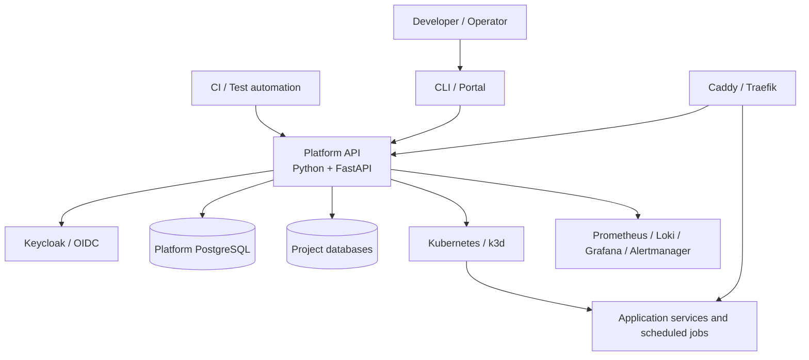

# Architecture overview

Status: selected single-host hybrid topology with one Python/FastAPI Platform API. Project workloads run in Kubernetes/k3d; no additional compute adapter or deployable platform-service split is in the current scope.

## Implemented platform

The [FastAPI service](../../platform/app/main.py) authenticates human and machine callers, owns projects and grants, accepts declarative application specifications, persists desired revisions and operations, provisions PostgreSQL bindings, applies Kubernetes resources, and exposes runtime status and diagnostics. Its in-process worker recovers queued or interrupted work after restart.

Docker runs the platform API, Keycloak, PostgreSQL, edge, monitoring, and k3d containers. Docker is host infrastructure, not an application workload provider. Kubernetes/k3d is the only supported application compute environment.

## Responsibility layers

1. **Infrastructure foundation:** the host, Docker, Kubernetes/k3d, PostgreSQL, networking, edge/TLS, monitoring, backups, Keycloak, and the external watchdog.
2. **Platform application:** one Python/FastAPI deployment owns metadata, authorization, deployment intent, durable operations, policy, infrastructure execution, runtime observation, diagnostics, and audit.
3. **Developer experience:** API, CLI, CI, test automation, and later the portal and AI assistance use the same authorized Platform API.

The Python code keeps catalog, authorization, lifecycle, operation, integration, and observation responsibilities modular. Those are internal boundaries, not separately deployed services or permission to duplicate authoritative state.

## Domain model

A Project owns its application specification, default environment, grants, revisions, operations, credentials, and resource inventory. An application can contain long-running service components and scheduled components. Stable platform IDs remain independent of Kubernetes namespace and resource names.

The platform stores desired state separately from observed runtime state. An accepted request records intent and an operation; it does not claim that the workload is healthy. Runtime status reports component readiness, scheduled-run state, and actionable failure reasons.

The public API uses platform concepts rather than Kubernetes kinds or Compose fields. Environment capabilities describe what the selected Kubernetes installation supports, and unsupported requests fail before side effects. This contract discipline does not require a second provider.

## Infrastructure and lifecycle boundaries

PostgreSQL data is independent of workload lifecycle. Removing or replacing Kubernetes resources does not implicitly remove project databases. Retirement and permanent deletion require explicit scoped decisions and auditable operations.

The Platform API directly integrates with Kubernetes, PostgreSQL, monitoring discovery, routing configuration, and Keycloak administration needed for machine credentials. Backend failures are redacted for callers and correlated through durable operation and audit identifiers.

## Optional expansion

A direct Docker application adapter and Kotlin/Spring catalog, Java/Quarkus
control plane, or separately deployed Python workers are outside the current
architecture. They may be considered independently in
[Architecture evolution](evolution.md) only after a concrete need is recorded and
migration, parity, recovery, and rollback gates are defined.

## Architecture map

- [Platform application](platform-application.md)
- [Application lifecycle](application-lifecycle.md)
- [Deployment topology](deployment-topology.md)
- [Security and authorization](security-and-authorization.md)
- [Observability](observability.md)
- [Application contract](application-contract.md)
- [Diagrams](diagrams/README.md)
- [Architecture decisions](decisions/README.md)
