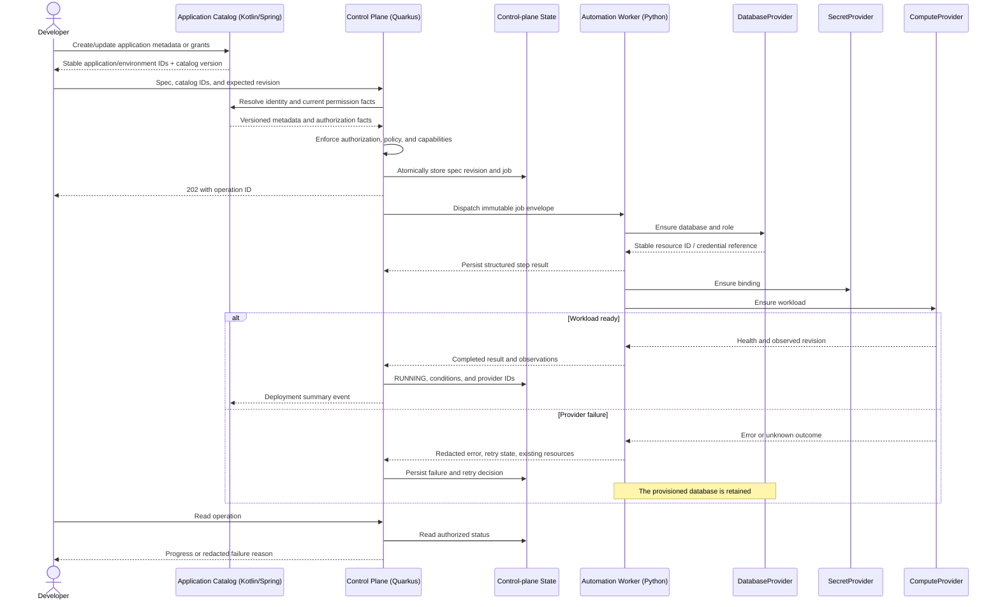

# Provisioning Sequence

Status: current queued-operation API and in-process worker. The second diagram records an optional Phase 5 service-extraction concept, not the selected delivery architecture. [Software architecture](../application-lifecycle.md).

## Current asynchronous acceptance and execution

```mermaid
sequenceDiagram
    actor Dev as Developer
    participant API as FastAPI
    participant PG as PostgreSQL
    participant Worker as Python worker thread
    participant K8s as Kubernetes API
    Dev->>API: PUT project spec + OIDC bearer token
    API->>API: Authenticate, authorize, validate
    API->>PG: Acquire global session advisory lock
    API->>PG: BEGIN: persist spec, revision, queued operation
    API->>PG: COMMIT; release lock
    API-->>Dev: 202 operation ID + status URL
    Worker->>PG: Claim queued or interrupted operation under advisory lock
    Worker->>PG: Recheck actor grant and latest revision
    Worker->>PG: Publish monitoring and ensure database
    Worker->>K8s: Server-side apply fixed resources
    Worker->>PG: Persist applied result or sanitized failure
    Dev->>API: GET /v1/operations/{id}
    API->>PG: Resolve project and current grant
    API->>K8s: Observe deployment and ready pod images
    API-->>Dev: Authorized apply outcome and live readiness snapshot
    Note over Dev,K8s: Readiness is separate from the persisted apply outcome
```

The worker reclaims a `running` operation when the prior process releases its session lock, retrying idempotent steps from the start. The monitoring-only thread also republishes discovery but does not reconcile workloads. Retirement separately acknowledges an already absent namespace, rejects active operations, and retains SQL/catalog data. See [ADR-012](../decisions/ADR-012-admin-provisioning-baseline.md) and [ADR-014](../decisions/ADR-014-catalog-availability-monitoring.md).

## Optional Phase 5 extracted-service contract



Routing and observability are also resumable steps; they are condensed here for readability. After a timeout, the worker observes provider state before attempting creation again. The worker cannot change the desired revision or expand the plan. Destructive work triggers control-plane reauthorization against the catalog before dispatch or commit.
