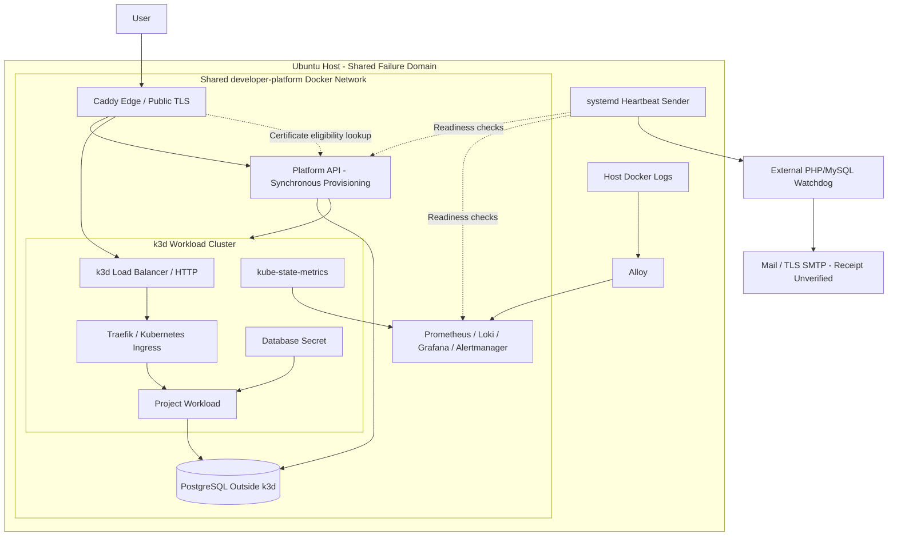

# Hybrid Topology

Status: current source topology, with Caddy edge and Traefik ingress selected in [ADR-009](../decisions/ADR-009-edge-and-cluster-ingress.md). Live TLS and complete recovery acceptance remain open; partial recovery evidence is recorded below. [Infrastructure details](../deployment-topology.md).

Arrows show logical flows rather than firewall rules. Caddy and shared services remain outside k3d, but all local components share one host failure domain. Public application TLS terminates at Caddy; the ingress hop is HTTP.

Separate Docker networks, the identity provider, durable worker and PostgreSQL/application telemetry remain target work. Encrypted S3 backup automation has operator-reported deployment and a successful isolated marker-based recovery drill; see [current backup progress](../../maintainers/delivery/backlog.md#current-backup-and-recovery-progress). The independently hosted watchdog has verified heartbeat outage/recovery receipt. Selected backup and Alertmanager notification receipts also have operator-reported evidence; remaining scenarios, application-rule delivery and broader failure acceptance remain open. The diagram omits the backup storage and temporary recovery VM.
