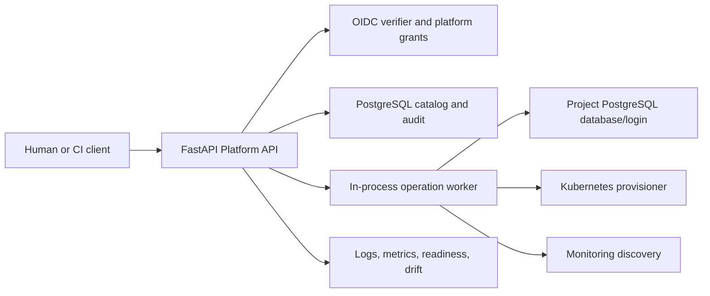
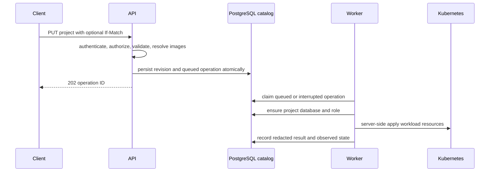
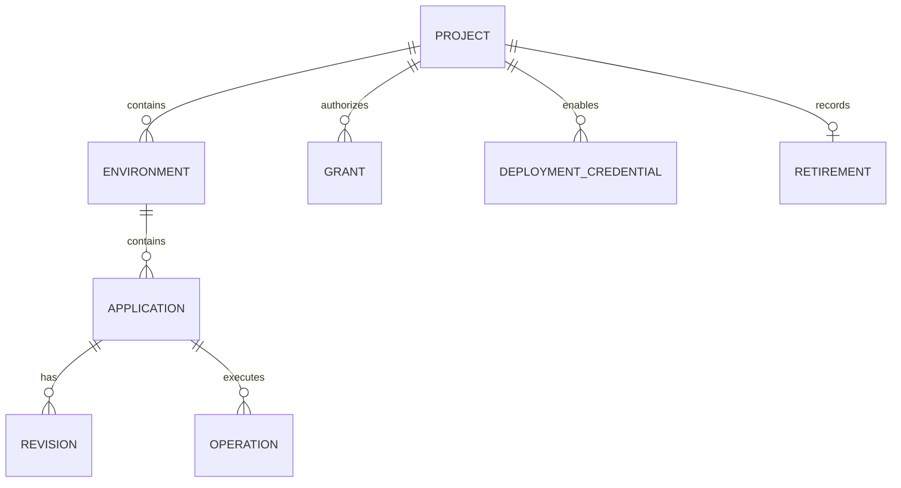

# Platform Application

Status: implemented as one Python/FastAPI application. This is the current
control-plane boundary; it is not a collection of independently deployed
microservices.

## Responsibilities

The application owns the public HTTP contract, OIDC authentication, platform
grants, desired application revisions, durable operations, audit events,
deployment credentials, and retirement inventory. It translates platform
concepts into PostgreSQL provisioning and Kubernetes resources. Project users
never receive PostgreSQL administrator credentials, Kubernetes credentials, or
the provisioner ServiceAccount token.

## Request boundary

Every authenticated project request validates the JWT issuer, signature,
audience, expiry, and stable subject. The API then checks a platform-owned
project or platform grant. `view`, `change`, `deploy`, and administration are
platform permissions, not Kubernetes RBAC grants.

The public contract accepts a legacy flat project body and versioned Application
envelopes. It rejects unsupported capabilities before catalog or provider side
effects. Image tags are resolved to digests before a revision is queued.
Responses expose platform concepts—projects, components, revisions, operations,
resources, and routes—not namespaces or provider credentials.

## Durable deployment workflow

`If-Match` prevents stale writes. Identical active deployment requests reuse an
operation; retries reconcile existing database and Kubernetes state rather than
blindly recreating it. PostgreSQL and Kubernetes are not one transaction, so
partial failure remains a durable, diagnosable operation result. Rollback
reapplies a retained application revision as a new revision; it never rolls back
database contents or migrations.

## Persistent model

The catalog has stable project, environment, and application IDs; immutable
application revisions; operations; grants; credentials; append-only audit
events; and retirement records. Project database data is deliberately separate
from the catalog. Secrets are stored in project Kubernetes Secrets, returned
write-only, and redacted from API responses and audit detail.

## Runtime observation and operations

The API distinguishes desired state, operation outcome, and live observation.
It provides readiness/component status, logs with bounded filters and polling
cursors, resource inventory and usage, drift reporting, revisions, and
operator capacity. Provider errors and missing metrics are explicit states,
not zero values. Drift is reported and audited; it is not silently reverted.

The process runs background loops for operations, monitoring discovery, security
alerts, drift scans, and deployment-credential cleanup. They use the catalog as
their durable source of truth; background work must recheck authorization and
record safe, redacted outcomes.

## Lifecycle boundaries

Retirement previews the scope, requires confirmation bound to a scope token,
removes selected workload resources, and retains data unless an explicit future
deletion policy says otherwise. Deployment credential revocation first removes
the platform grant, so an otherwise valid OIDC token is denied before identity
provider cleanup completes.

## Security and limits

Audit detail is redacted, sensitive values are never listed through the secrets
API, and public errors avoid backend exception detail. The Platform API itself
is privileged infrastructure and therefore part of the host trust boundary.
Current limitations include a single process, shared PostgreSQL host, in-process
workers, and no hostile-tenant isolation or high availability.

For endpoint-level usage see the [platform guide](../../platform/README.md);
for selected architecture rationale see [software architecture](application-lifecycle.md)
and [Kubernetes infrastructure](../operators/infrastructure.md).
