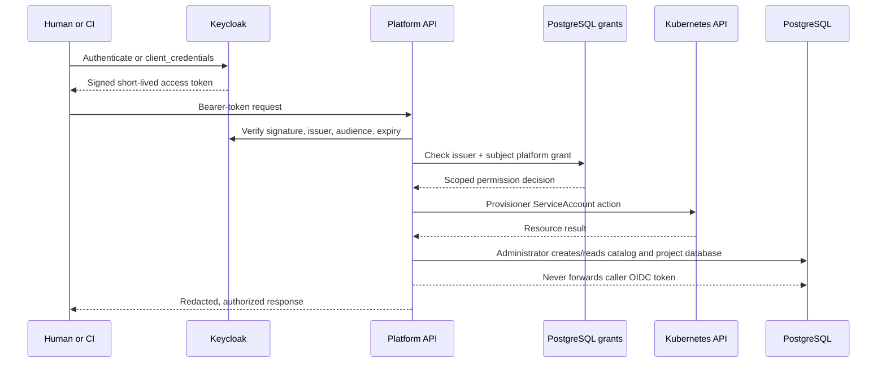
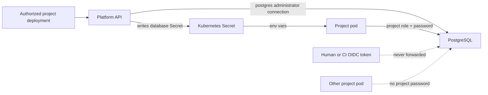
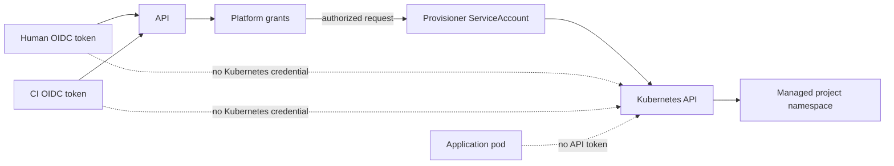

# Security and authorization

Status: current consolidated security and authorization model. Keycloak
authenticates callers; the Platform API owns platform authorization; the API
alone holds Kubernetes infrastructure authority. Historical design material was
consolidated from the earlier security and authorization-principles pages.

## The three layers

1. **Keycloak authentication** proves the issuer and immutable subject of a
   human or machine caller with a short-lived OIDC access token.
2. **Platform authorization** maps that issuer/subject pair to platform-owned
   project or platform grants stored in PostgreSQL.
3. **Kubernetes execution** occurs only through the Platform API's provisioner
   ServiceAccount after a platform permission check succeeds.
4. **PostgreSQL authorization** is a separate database connection and privilege
   decision. The API creates the project login/database and a workload connects
   using that login; Keycloak tokens are never presented to PostgreSQL.

Keycloak roles and a valid JWT do not by themselves grant access to a project or
to Kubernetes. Project users, CI clients, and application pods do not receive a
kubeconfig or the provisioner token.

## Keycloak identities

Humans normally use Authorization Code with PKCE through the browser portal or a
supported OIDC flow for CLI/API access. The API validates JWT signature through
the issuer JWKS, configured issuer, `platform-api` audience, expiry, and stable
subject.

CI uses a separate confidential Keycloak client generated for a deployment
credential or test identity. It obtains tokens with `client_credentials`. The
returned client secret is disclosed once; it is distinct from a person’s token
and from infrastructure credentials.

## Platform-owned grants

After authentication, the API uses the immutable `(issuer, subject)` pair to
look up project and platform grants in its catalog. Permissions distinguish
observation, change, deployment, project administration, and platform
administration. This permits immediate platform denial without waiting for JWT
expiry: removing a grant makes the next API request fail even if its Keycloak
token remains cryptographically valid.

Audit records attribute actions to the authenticated principal. Values of bearer
tokens, secrets, and database credentials are redacted.

## PostgreSQL authorization

PostgreSQL is outside k3d on the shared Docker network. It is not an OIDC
resource server in this implementation: it does not validate Keycloak JWTs and
does not know the human or CI principal that requested a deployment. Its native
authentication is the PostgreSQL role/password presented on a database
connection. The Platform API therefore must not treat a successful OIDC request
as authority to give the caller a database password or direct SQL access.

There are two distinct database authority paths:

| Path | Database identity | Current authority |
|---|---|---|
| Platform control plane | `postgres`, held by the Platform API | Creates the catalog tables and project roles/databases; reads/writes platform grants, desired state and audit records |
| Project workload | `project_<project-name>`, injected into that project's pods | Connects to its own project database and, because it owns that database, currently performs application SQL and schema migration |

When an authorized create/update request provisions project `orders`, the API
derives `project_orders` and a password from `DATABASE_KEY`, creates the login
only if absent with `NOSUPERUSER`, `NOCREATEDB`, and `NOCREATEROLE`, creates its
database with that role as owner if absent, and revokes `PUBLIC` access to that
database. It creates the Kubernetes `database` Secret with `PGHOST`, `PGPORT`,
`PGDATABASE`, `PGUSER`, and `PGPASSWORD`; the workload receives these values as
environment variables. The Secret is not returned by platform read APIs.

Kubernetes controls delivery of the Secret to the pod; PostgreSQL controls
whether the supplied role can connect and what it can do once connected. The
network policy complements both: project workloads may make TCP/5432 egress
only to the configured PostgreSQL IP, alongside same-namespace traffic and DNS.
It is a reachability control, not a substitute for SQL authorization.

### Current limits and lifecycle implications

The current per-project role owns its database, so it has broader schema power
than a future least-privilege runtime role would. Separate runtime,
migration/owner, and human database roles are intentionally not implemented;
there is also no platform endpoint for interactive human SQL access. A database,
role, and catalog entry are retained on project retirement rather than deleted.

Passwords are deterministic while `DATABASE_KEY` remains unchanged. Changing
only that key and redeploying changes the Kubernetes Secret but does **not**
change an existing PostgreSQL role password; rotation must coordinate SQL, Secret
update, and workload reconnection. PostgreSQL transport encryption is not
configured in this single-host baseline. Treat the database network and the
Platform API's administrator credential as trusted infrastructure, and do not
use this arrangement for hostile multi-tenant workloads.

For the authoritative implementation limits and planned identity split, see
[ADR-013](decisions/ADR-013-database-credential-lifecycle.md) and
[ADR-003](decisions/ADR-003-postgresql-provisioning.md).

## Kubernetes authority

The Docker-hosted API uses the `platform-system/provisioner` ServiceAccount to
reconcile namespaces, secrets, quotas, limit ranges, deployments, CronJobs,
Services, Ingresses, NetworkPolicies, pod logs, and pod metrics. It is trusted
infrastructure, not a tenant identity.

RBAC grants namespace deletion because retirement needs it, but a
`ValidatingAdmissionPolicy` restricts that action to the provisioner identity
and managed labelled `project-*` namespaces. This compensates for RBAC’s lack
of name/label-scoped delete rules.

## Workload restrictions

Project pods have no automatically mounted Kubernetes API token. They run
non-root with a read-only root filesystem, dropped capabilities, RuntimeDefault
seccomp, and network policies. These controls reduce authority but do not make
the single shared Docker host suitable for hostile tenants.

## Revocation and rotation

| Target | Immediate platform effect |
|---|---|
| Project/platform grant | Next request by the identity is denied |
| Deployment credential | Platform grant is removed before Keycloak client cleanup |
| Provisioner token | Delete `provisioner-token`, rerun bootstrap, restart API |
| Application secret | Versioned Secret rotation rolls workloads; confirm/revert controls old value removal |

See [platform application](platform-application.md), [Kubernetes infrastructure](../operators/infrastructure.md), and the [human authorization runbook](../operators/validation/access-and-authorization.md).
