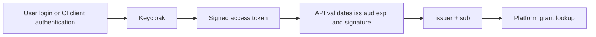
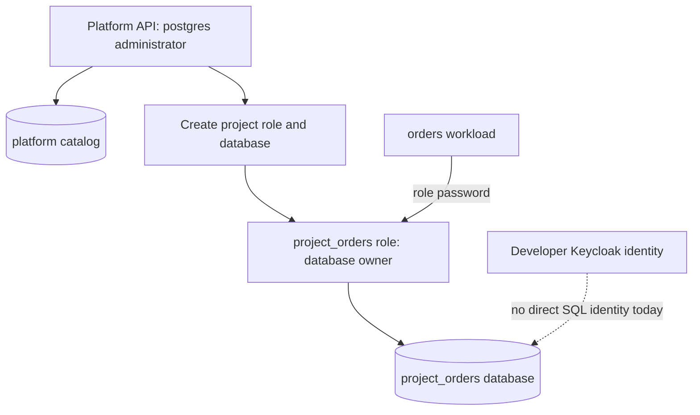
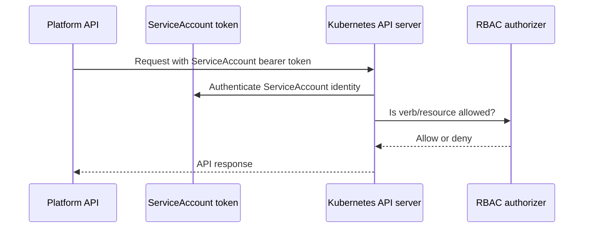

# Keycloak, Kubernetes, and PostgreSQL Authorization Principles (historical)

Status: historical design input. Its lasting principles are consolidated in the
[current security and authorization model](../../../architecture/security-and-authorization.md).

This guide explains the underlying mechanisms used by the platform. It is
background for the implemented [authorization boundary](../../../architecture/security-and-authorization.md), not a substitute for its platform-specific contract.

## Keycloak and OpenID Connect

Keycloak is an identity provider. It authenticates a person or a machine and
issues signed OAuth 2.0/OpenID Connect tokens. A token is evidence that Keycloak
authenticated a subject; it is not automatically permission to use every
application that trusts Keycloak.

### Realms, clients, and subjects

A **realm** is an identity/security domain. The lab uses a `platform` realm.
A **client** represents an application that requests tokens: for example, a
browser portal client, CLI client, or a confidential CI client. A human user or
service account has an immutable subject identifier (`sub`). The platform uses
the pair `(issuer, sub)` as its stable principal key rather than display names
or mutable email addresses.

### Access tokens

An access token is normally a JSON Web Token (JWT). Relevant claims include:

| Claim | Meaning in this platform |
|---|---|
| `iss` | Identifies the Keycloak realm that issued the token |
| `sub` | Stable human or machine identity used for grant lookup |
| `aud` | Must include the Platform API audience |
| `exp` | Limits token lifetime |
| signature | Proves the token was signed by a trusted issuer key |

The API obtains the issuer's public signing keys from its JWKS endpoint and
validates signature, issuer, audience, and expiry before consulting platform
grants. This prevents accepting a token merely because it resembles a JWT.

### Public and confidential clients

A public browser client cannot safely keep a client secret. Authorization Code
with PKCE binds the authorization response to a verifier generated by the
browser, reducing code-interception risk. A confidential CI client can protect a
client secret and uses OAuth `client_credentials` to obtain a machine token.

The confidential client secret authenticates the CI client to Keycloak. It does
not bypass platform authorization: the resulting subject still needs a current
platform grant.

### Authentication versus authorization

Realm roles and client roles can be useful identity-provider attributes, but
this platform intentionally keeps project permissions in PostgreSQL. It needs
project-scoped grants, platform-controlled immediate revocation, and durable
audit correlation independent of Keycloak role-management conventions.

## PostgreSQL authorization principles

PostgreSQL has its own authentication and authorization model. It is neither an
OIDC relying party nor a Kubernetes RBAC API: a PostgreSQL server normally
authenticates a connection according to its host-based authentication policy
and the database role credentials supplied by the client, then evaluates SQL
privileges for that role. A valid Keycloak token says nothing to PostgreSQL
unless an integration explicitly translates it into a database identity; this
platform deliberately does not have such an integration.

### Roles, databases, ownership, and privileges

A PostgreSQL **role** can be a login identity and can own database objects. A
database is an isolated namespace within one PostgreSQL server, but it shares
the server's process, version, storage, capacity, and administrator. Ownership
is powerful: an owner can generally change or drop objects it owns. Object
privileges such as `CONNECT`, schema `USAGE`, and table/sequence privileges
then determine what non-owner roles can do.

The current platform uses one login role per project and makes it the owner of
its project database. That prevents it from being a server administrator and
removes `PUBLIC` database access, but it is not the planned separation between
an application runtime role, a schema-migration owner, and a human operator
role. The latter split would make revocation and audit attribution more precise
and reduce what a compromised application credential can change.

### Independent trust boundaries

The platform composes, rather than merges, three decisions:

1. Keycloak proves who may call the Platform API.
2. The API's PostgreSQL-backed grant catalog decides whether that caller may
   request a platform operation.
3. PostgreSQL decides whether the database role supplied by the deployed
   workload may connect and execute SQL.

The API uses its administrator connection for control-plane work, then places a
project database credential in a Kubernetes Secret. Kubernetes makes the Secret
available to the selected workload; PostgreSQL still authenticates its later
TCP connection independently. NetworkPolicy confines normal database egress to
the configured PostgreSQL address and port, but network reachability alone
does not grant a SQL privilege.

This distinction matters operationally: revoking a platform grant prevents the
principal from making future Platform API requests but does not disconnect an
already running pod or rotate its database password. Revoking a database role
or changing its password affects SQL connections but does not remove a user's
Keycloak access or platform grant. Coordinated rotation must handle both layers.

## Kubernetes authorization

Kubernetes treats every API request as an authenticated identity plus an
authorization decision. The API server first identifies the caller, then asks
its configured authorizer—normally RBAC—whether that identity may perform a
verb on a resource.

### ServiceAccounts and bearer tokens

A **ServiceAccount** is a Kubernetes workload/infrastructure identity. The
platform's provisioner ServiceAccount lives in `platform-system`; its token is
used by the external Platform API to call the Kubernetes API. It is separate
from Keycloak users and has no relationship to their OIDC tokens.

### RBAC objects

`Role` and `ClusterRole` contain rules: API groups, resource types, and verbs
such as `get`, `list`, `create`, `patch`, `update`, and `delete`. Bindings attach
those rules to identities. The provisioner needs a `ClusterRole` because it
creates project namespaces and reconciles objects across many namespaces.

RBAC is additive: a binding grants allowed actions; it does not express a
general deny rule. Crucially, ordinary RBAC cannot say “delete namespaces only
when their name starts with `project-` and they have a managed label.”

### Admission control

Admission occurs after authentication and authorization but before an accepted
API request is persisted. The platform's `ValidatingAdmissionPolicy` adds the
attribute-level namespace-delete constraint that RBAC lacks. It checks the
requesting ServiceAccount and the existing namespace name/labels, then denies
anything outside managed project namespaces.

### Pod identity and least privilege

The platform sets `automountServiceAccountToken: false` for project workloads.
Consequently, application pods do not receive an in-cluster API bearer token by
default and cannot call Kubernetes as a ServiceAccount. NetworkPolicy, non-root
execution, read-only filesystems, dropped capabilities, and seccomp are separate
defense layers; none replaces API authorization.

## How the layers fit together

Keycloak authenticates the external caller. The Platform API applies product
authorization and audit rules. Kubernetes authorizes the API's infrastructure
identity. Keeping these layers distinct avoids giving every developer or CI job
direct cluster authority while retaining a narrow, auditable controller path.

See [authorization implementation](../../../architecture/security-and-authorization.md) for
the concrete platform flow and [Kubernetes infrastructure](../../../operators/infrastructure.md)
for the deployed ServiceAccount/RBAC resources.
