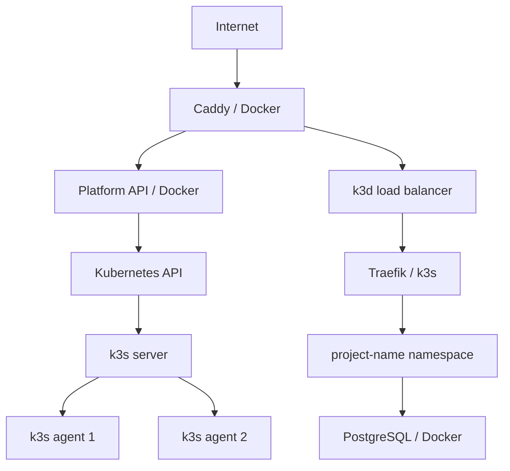
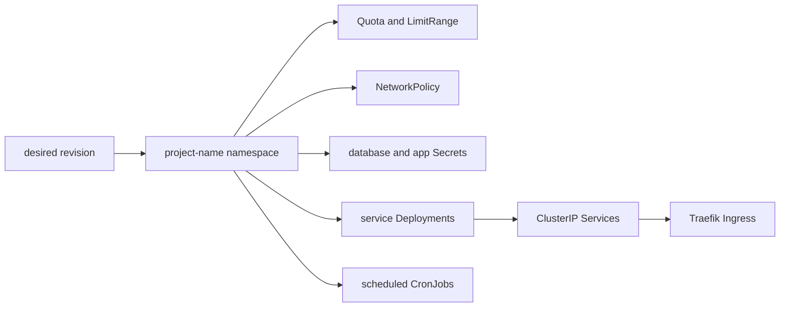
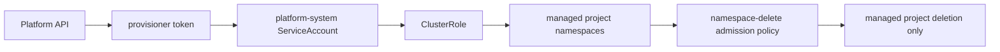

# Platform infrastructure

Status: implemented single-host k3d/k3s workload plane. This page documents repository configuration, not production or hostile-tenant isolation acceptance.

## Role and topology

Kubernetes runs developer workloads. Caddy, the Platform API, PostgreSQL, Keycloak, and monitoring run as Docker Compose services on the same Ubuntu host. `scripts/cluster_config.py` configures k3d with one k3s server, two agents, and a load balancer. The load balancer publishes HTTP only on `127.0.0.1:8081`; Caddy is the public edge.

`scripts/up.sh` renders the k3d configuration, creates or starts cluster `workloads`, writes `.runtime/admin.kubeconfig`, applies the controller and metrics manifests, and refreshes the load balancer after Compose networking is ready. The server enables secrets encryption and has a TLS SAN for its Docker-network name.

## Runtime inventory

| Component | Default operator endpoint | State and responsibility |
|---|---|---|
| Caddy | `127.0.0.1:80/443` locally; configured edge address remotely | TLS, Platform API route, and workload edge route; certificate data is in its Compose volume |
| Platform API | `127.0.0.1:8000` | Public platform contract, durable operations, authorization, audit, and provider execution |
| Keycloak | `identity.localhost` locally or `IDENTITY_DOMAIN` remotely | Reference OIDC identities and clients; state is in the Keycloak PostgreSQL database |
| PostgreSQL | Docker network only | Platform catalog, audit, and per-project databases in persistent Compose storage |
| k3d load balancer | `127.0.0.1:8081` behind Caddy | Routes workload HTTP to Traefik and project Services |
| Prometheus | `127.0.0.1:9090` | Metrics, rules, and generated discovery targets |
| Grafana | `127.0.0.1:3000` | Dashboards; administrator password comes from `.env` |
| Alloy and Loki | Internal Compose endpoints | Docker log collection and query storage |
| Alertmanager | Internal Compose endpoint | Alert grouping and configured receivers |

The private `.env` is the installation's secret/configuration input and must be
backed up securely. `.runtime/admin.kubeconfig` is the local cluster administrator
credential. Neither belongs in Git or incident attachments. Optional backup,
heartbeat, and watchdog state is documented under
[Operational components](components/README.md).

## Project resources

Each project receives `project-<name>`. The Platform API reconciles Namespace, ResourceQuota, LimitRange, NetworkPolicy, database Secret, workload Deployment(s), Service(s), and public Ingress where applicable. Component applications create one Deployment per long-running service and one CronJob per scheduled component. CronJobs use `Forbid` concurrency and bounded job history.

Workload pods run non-root as UID/GID 10001, have read-only root filesystems, drop capabilities, use RuntimeDefault seccomp, mount writable `/tmp`, and do not mount Kubernetes API tokens. These controls reduce accidental privilege; they do not provide hostile-tenant isolation on the shared host.

## Provisioner authority

The Docker-hosted Platform API is trusted infrastructure. Its `platform-system/provisioner` ServiceAccount has the cluster-level rights necessary to reconcile project resources, inspect pod logs, and read pod metrics. Kubernetes users do not receive this credential. A ValidatingAdmissionPolicy limits the provisioner's namespace deletion to labelled, managed `project-*` namespaces.

The ServiceAccount token is a sensitive, long-lived infrastructure credential. Rotate it by deleting `provisioner-token`, rerunning bootstrap, and restarting the API.

## Networking

Ingress reaches pods only through Traefik. NetworkPolicies allow same-namespace traffic, DNS, and PostgreSQL at the configured fixed Docker-network IP; other egress is denied after policy convergence. New pods can briefly have egress before kube-router rules apply. Compose DNS does not resolve from pods, so PostgreSQL uses a fixed private IP. PostgreSQL TLS is not configured.

## Metrics and capacity

`kube-state-metrics` runs in `platform-system` with list/watch access to nodes, namespaces, pods, and workload controllers. Prometheus reaches it through NodePort 30090 on the k3d server. The Platform API reads core Node allocatable values and active Pod requests for aggregate admission, plus pod and node metrics for observed usage. The audited `/operator/capacity` view exposes both views with explicit unavailable states rather than treating missing provider data as zero. Admission is opt-in and its enablement and CPU/memory reserves are managed by the deployment inventory.

## Persistence and failure domain

Kubernetes objects are disposable desired-state projections. Platform catalog, grants, audit records, project databases, and identity data live in external PostgreSQL volumes. Recreating k3d requires catalog replay and is not a database restore.

All local components share one host failure domain: Docker, k3d, edge, PostgreSQL, and local monitoring can fail together. The external watchdog is the independent host-outage signal. Use the Ansible acceptance playbooks for disposable live drills.

## Current limits

- No high availability or multi-host control plane.
- No hostile-tenant isolation claim.
- Kubernetes API, Docker socket, PostgreSQL, and monitoring backends are not public interfaces.
- Aggregate admission accounts for Kubernetes requests, not host processes, shared Compose services, storage, or transient runtime usage; those measurements and capacity alerts remain operational work.
- Pod-log retention is kubelet best effort, not a platform retention guarantee.
