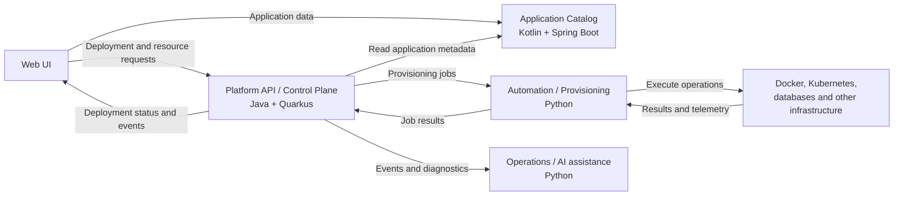

# Developer Platform: Technology Roles and Service Boundaries

Status: integrated into the target [architecture overview](docs/02-architecture/overview.md), [software architecture](docs/02-architecture/software-architecture.md), [ADR-006](docs/03-decisions/ADR-006-python-quarkus-evolution.md), and [development plan](docs/04-development/development-plan.md) on October 1, 2026. Those documents are authoritative for boundaries, sequencing, and acceptance; this file retains the originating summary.

This document describes the intended division of responsibilities in the Developer Platform. The platform uses each language and framework where its strengths fit the workload: **Kotlin + Spring Boot** for application data and domain rules, **Java + Quarkus** for the platform runtime and control plane, and **Python** for infrastructure automation and operations. These are architectural roles; individual services can be introduced as the platform grows.

## Architecture at a glance

## Kotlin + Spring Boot: application and domain management

The **Application Catalog** owns the durable business description of an application: its identity, owners, repositories, environments, dependencies, permissions, and intended resource relationships. It exposes APIs for creating and managing those records and enforces domain rules such as valid ownership and application configuration. Spring Boot and Kotlin fit this data-oriented service, where expressive domain models, persistence, validation, and the Spring ecosystem are useful.

The catalog is the source of truth for **what an application is and who may manage it**. It does not deploy workloads, provision infrastructure, or act as the source of truth for live runtime state. A deployment summary shown in the catalog may be derived from control-plane events, but the control plane remains authoritative for deployment execution and status.

## Java + Quarkus: platform runtime and control plane

The **Platform API** accepts declarative deployment and resource requests, validates them against application metadata and platform rules, and coordinates their execution. It owns deployment lifecycle state, runtime abstractions for Docker and Kubernetes, configuration and secret references, resource management, and platform events. Quarkus is suited to this infrastructure-facing service and keeps the Java-based runtime distinct from the business domain service.

The control plane decides **what operation should happen**, tracks its progress, and reports the outcome. It delegates concrete infrastructure steps to automation workers rather than embedding every provider-specific script in the API. Infrastructure-specific results return to the control plane, which records the operation status and publishes events for consumers.

## Python: automation, provisioning, and operations

Python workers execute the integration-heavy work requested by the control plane: Docker or Kubernetes operations, database provisioning, secret generation, monitoring setup, backups, audits, and infrastructure checks. Python is also the home for operations tools such as log analysis, deployment diagnostics, incident analysis, and a future AI-assisted operations agent.

Python owns **how an approved operation is carried out** against external systems. It does not own application records or decide platform policy. AI-assisted analysis can suggest or explain actions; any state-changing action still goes through the control plane's normal authorization and execution path.

## Interaction and ownership rules

1. A user creates or updates an application through the catalog. The catalog stores its domain metadata and validates the change.
2. A deployment or resource request reaches the control plane with an application identifier and desired specification. The control plane consults the catalog for relevant metadata and permissions.
3. The control plane records the operation, dispatches a provisioning job to Python, and tracks its lifecycle.
4. Python performs the external operation and returns a structured result. The control plane updates runtime status and emits events. The UI or other consumers can use those events to show progress.

Service contracts should exchange application identifiers, desired specifications, job identifiers, results, and events rather than sharing database tables. Each service owns its data and exposes the facts other services need through an API or event contract. Long-running operations should have explicit status and failure information so retries and diagnostics remain understandable.

## Why a polyglot architecture?

This split follows the work each component performs. Kotlin + Spring Boot supports domain modeling and data management; Java + Quarkus provides a focused platform control plane; Python provides a broad ecosystem for infrastructure integrations and operational analysis. Clear ownership makes the technology choice explainable while allowing each part to evolve independently. The extra service boundaries are justified only when they preserve these responsibilities and remain backed by clear contracts.
